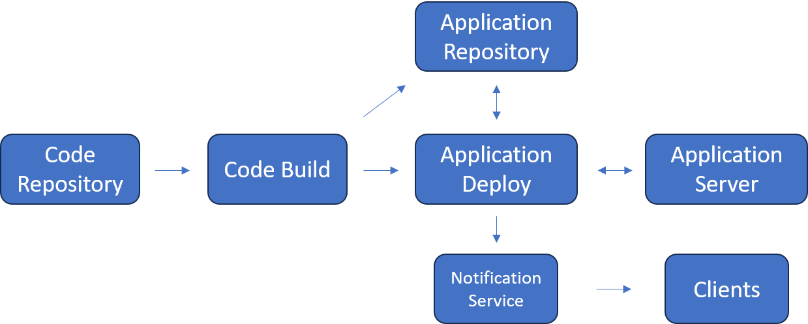

# Devops

* [Code Repository](../../service/repository/readme.md)
* [Application Repository](../../service/repository/readme.md)
* [Application Deploy](../../service/cicd/readme.md)
* Application Server
  * [OS](../../os/readme.md)
  * [Container](../../service/container/readme.md)
* [Notification](../../service/notification/readme.md)