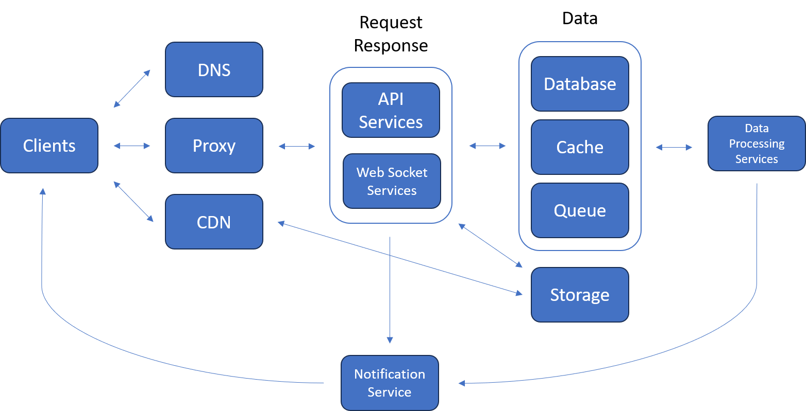

# Front - End

## Service
* [DNS](../../service/dns/readme.md)
* [Proxy](../../service/proxy/readme.md)
* [CDN](../../service/cdn/readme.md)
* [API](../../service/backend/readme.md)
* [Websocket](../../service/websocket/readme.md)
* [Database](../../service/database/readme.md)
* [Cache](../../service/database/readme.md)
* [Queue](../../service/queue/readme.md)
* [Storage](../../service/storage/readme.md)
* [Notification](../../service/notification/readme.md)