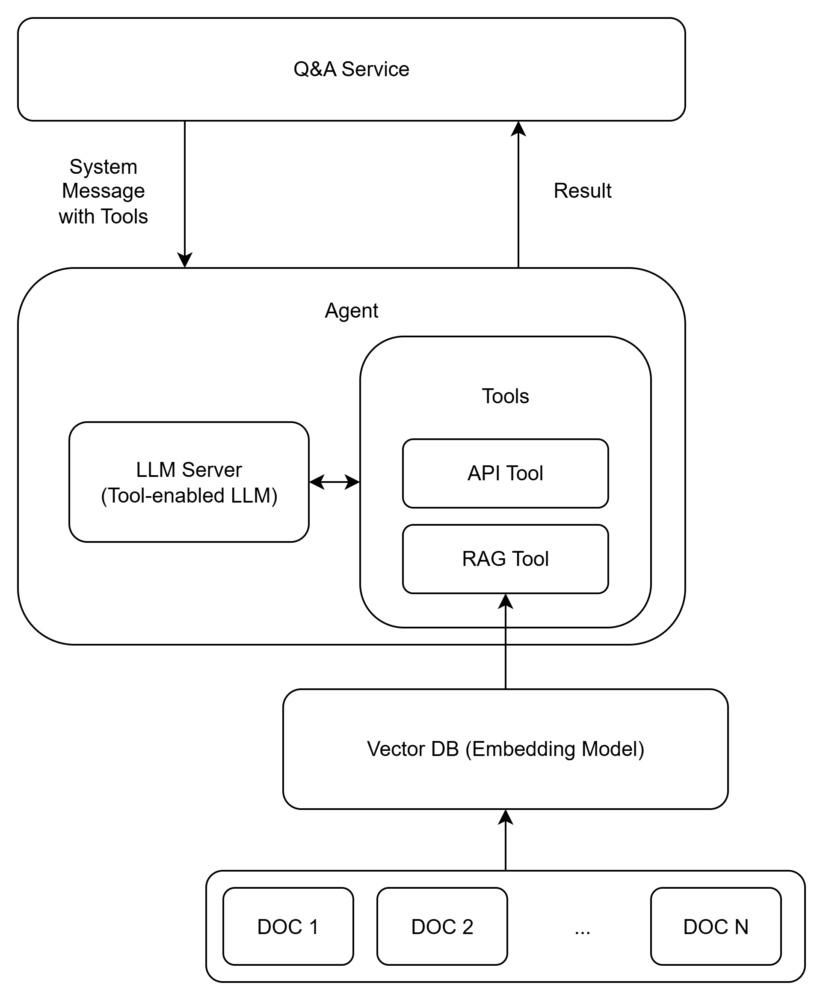

## Monitor

AI Agent可以設定不同Tools來對不同的資料源做資料搜尋，可以呼叫API、可以搜尋Vector DB

先定義好Tools
```
@tool
def get_order_info(order_id: str) -> dict:
    """透過 API 取得指定訂單的資訊，例如訂單狀態和追蹤號。"""
    print('order_id: ', order_id)
    return {"status": "shipped", "tracking": "ABC123"}

@tool
def get_inventory(product_id: str) -> dict:
    """查詢指定商品的庫存數量和可用性。"""
    print('product_id: ', product_id)
    return {"stock": 50, "available": True}

@tool
def rag_retrieve(query: str) -> str:
    """從知識庫檢索與查詢相關的資訊。"""
    query_docs = retriever.get_relevant_documents(query)
    return "\n".join([doc.page_content for doc in query_docs])

```

可以透過Agent將LLM Server跟Tools綁定
```
llm = ChatOllama(
    model="llama3.1",  # 改用支援工具調用的模型
    base_url="http://localhost:11434"
)
tools = [get_order_info, get_inventory, rag_retrieve]
agent = create_react_agent(llm, tools)
```

建置System Message定義哪些情境用哪些Tool
```
system_message = SystemMessage(content="""你是電商客服，回答簡潔且專業。
步驟1: 解析用戶查詢（訂單、庫存、其他）。
步驟2: 使用適當工具（get_order_info、get_inventory、rag_retrieve）獲取資料。
步驟3: 合成友善的自然語言回應。""")
```

跟agent提問問題
```
question = input("🔍 問題 / Question: ")
if question.lower() in {"exit", "quit"}:
  break
messages = [system_message, HumanMessage(content=question)]
response = agent.invoke({"messages": messages})
print("\n📣 回答 / Answer:\n", response["messages"][-1].content)
```

## Model
* Embedding Model
* Tool Enabled LLM 

## Service
* Vector DB
  * FASSIS
  * Milvus

* LLM Server
  * Ollama