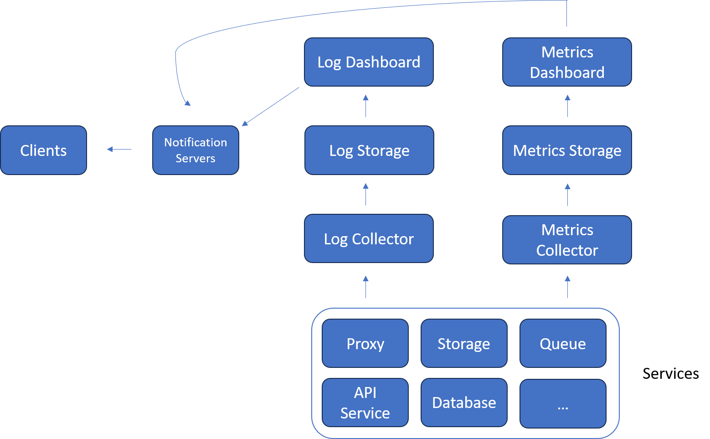

## Monitor

Log 跟 Metric從Collector - Dashboard都算是Monitor服務的一環，兩個最大的差別就在於資料的使用。

Log類型的資料常常會被用來搜尋，所以存的DB都要能支援倒敘索引，所以都是存在Elasticsearch，
因此Dashboard也要支援Elasticsearch。

## Service
* [Monitor](../../service/monitor/readme.md)
* Storage
    * [Database](../../service/database/readme.md)
    * [Storage](../../service/storage/readme.md)
* [Notification](../../service/notification/readme.md)