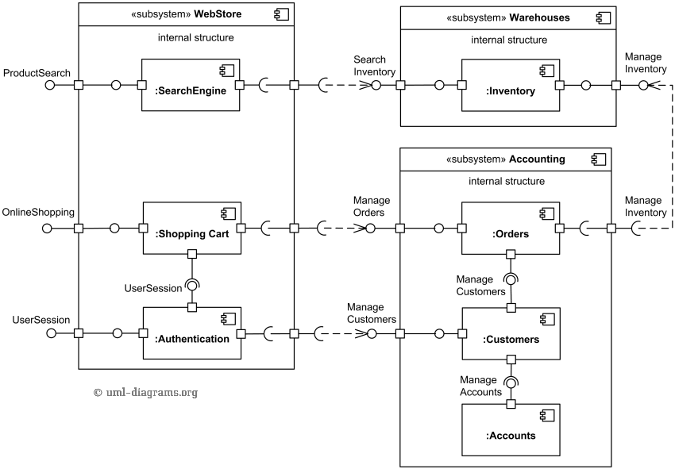
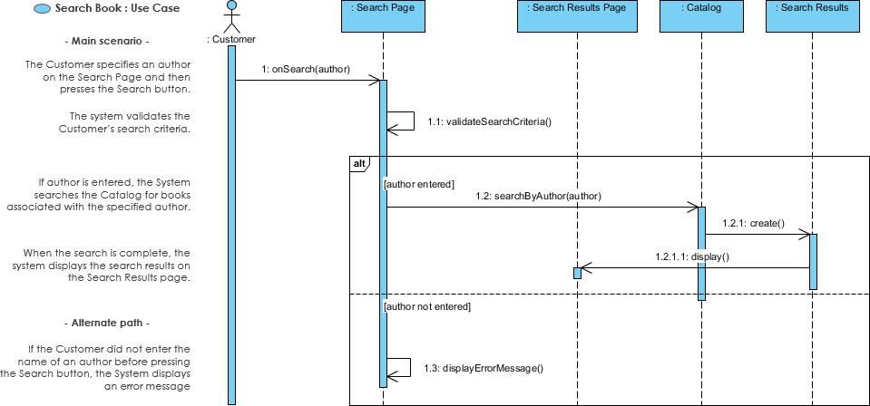

# UML
UML（統一建模語言，Unified Modeling Language）是一種標準化的建模語言，用於設計、視覺化和記錄軟件系統的結構、行為和交互。它廣泛應用於軟件工程，幫助開發者、設計者和利益相關者更好地理解和溝通系統設計。UML圖有多種類型，分為**結構圖**和**行為圖**兩大類，以下是主要UML圖的介紹：

---
### 一、結構圖（Structural Diagrams）
結構圖展示系統的靜態結構，描述系統的組成部分及其關係。

1. **類圖（Class Diagram）**
    - **用途**：描述系統中的類、它們的屬性、方法以及類之間的關係（如繼承、關聯、聚合、組合等）。
    - **元素**：類（Class）、接口（Interface）、關聯（Association）、泛化（Generalization）、依賴（Dependency）。
    - **應用場景**：設計軟件架構，定義對象模型。
    - **示例**：一個電商系統的類圖可能包括「顧客」「訂單」「產品」等類，並顯示它們之間的關係。

2. **對象圖（Object Diagram）**
    - **用途**：展示某個時刻系統中對象的快照，顯示實例化的類及其關係。
    - **元素**：對象（Object）、鏈接（Link）。
    - **應用場景**：驗證類圖的實例化場景，檢查設計是否合理。
    - **示例**：展示某個顧客對象與訂單對象的具體關係。

3. **組件圖（Component Diagram）**
    - **用途**：描述系統的物理組件（如模塊、庫、文件）及其關係。
    - **元素**：組件（Component）、接口（Interface）、依賴關係。
    - **應用場景**：展示系統的模塊化結構，適用於大型系統設計。
    - **示例**：展示一個Web應用程序的前端、服務器和數據庫組件。

4. **部署圖（Deployment Diagram）**
    - **用途**：展示系統的物理部署結構，如硬件節點和軟件組件的分佈。
    - **元素**：節點（Node）、組件（Component）、通信路徑。
    - **應用場景**：設計系統的硬體架構，分析部署環境。
    - **示例**：展示伺服器、數據庫和客戶端設備之間的關係。

5. **包圖（Package Diagram）**
    - **用途**：展示系統的邏輯分組（如包、命名空間）及其依賴關係。
    - **元素**：包（Package）、依賴（Dependency）。
    - **應用場景**：組織大型系統的模塊結構。
    - **示例**：將系統分為「業務邏輯」「數據訪問」「用戶界面」等包。
    

6. **結構化類圖（Composite Structure Diagram）**
    - **用途**：展示類內部的結構及其組成部分的交互。
    - **元素**：部件（Part）、連接器（Connector）。
    - **應用場景**：分析複雜對象的內部結構。
    - **示例**：展示汽車系統中引擎與輪胎的內部交互。

7. **輪廓圖（Profile Diagram）**
    - **用途**：定義UML的擴展（如自定義的建模規則）。
    - **元素**：輪廓（Profile）、刻板印象（Stereotype）。
    - **應用場景**：為特定領域（如嵌入式系統）定制UML模型。

---

### 二、行為圖（Behavioral Diagrams）
行為圖展示系統的動態行為，描述系統如何運作以及對象之間的交互。

1. **用例圖（Use Case Diagram）**
    - **用途**：展示系統的功能需求，描述用戶（或外部系統）與系統的交互。
    - **元素**：參與者（Actor）、用例（Use Case）、關聯（Association）、包含（Include）、擴展（Extend）。
    - **應用場景**：需求分析，與利益相關者溝通功能需求。
    - **示例**：電商系統的用例圖可能包括「瀏覽產品」「下訂單」「支付」等用例。

    
2. **活動圖（Activity Diagram）**
    - **用途**：展示業務流程或系統內的動態行為，類似於流程圖。
    - **元素**：活動（Activity）、決策節點（Decision Node）、開始/結束節點、泳道（Swimlane）。
    - **應用場景**：建模業務流程或操作流程。
    - **示例**：展示訂單處理的流程，從「接收訂單」到「發貨」。

3. **狀態機圖（State Machine Diagram）**
    - **用途**：展示對象在生命週期中的狀態變化及觸發事件。
    - **元素**：狀態（State）、轉換（Transition）、事件（Event）。
    - **應用場景**：建模對象的狀態變化，如訂單的「待支付」「已發貨」「已完成」。
    - **示例**：展示ATM機的「等待輸入」「處理交易」「結束」等狀態。

4. **序列圖（Sequence Diagram）**
    - **用途**：展示對象之間的交互順序，強調時間順序。
    - **元素**：對象（Object）、生命線（Lifeline）、消息（Message）、激活條（Activation Bar）。
    - **應用場景**：設計系統交互，分析用例的實現。
    - **示例**：展示用戶登錄系統時，客戶端、服務器和數據庫之間的消息交互。

    - 
5. **通信圖（Communication Diagram）**
    - **用途**：展示對象之間的交互，強調對象之間的關係而非時間順序。
    - **元素**：對象（Object）、鏈接（Link）、消息（Message）。
    - **應用場景**：分析對象之間的協作關係。
    - **示例**：展示支付流程中各組件的交互。

6. **交互概覽圖（Interaction Overview Diagram）**
    - **用途**：將活動圖與序列圖結合，展示高級交互流程。
    - **元素**：交互片段、活動節點。
    - **應用場景**：概述複雜的交互流程。
    - **示例**：展示系統啟動的整體交互流程。

7. **時序圖（Timing Diagram）**
    - **用途**：展示對象狀態隨時間變化的時序關係。
    - **元素**：時間軸、狀態、持續時間約束。
    - **應用場景**：分析實時系統或時間敏感的行為。
    - **示例**：展示交通燈系統的紅綠燈狀態變化。

---

### UML圖的應用
- **需求分析**：用例圖、活動圖幫助捕獲和描述需求。
- **系統設計**：類圖、組件圖、部署圖用於設計系統結構。
- **行為建模**：序列圖、狀態機圖展示系統的動態行為。
- **文檔記錄**：UML圖作為標準化的視覺化工具，便於團隊溝通和系統文檔化。
