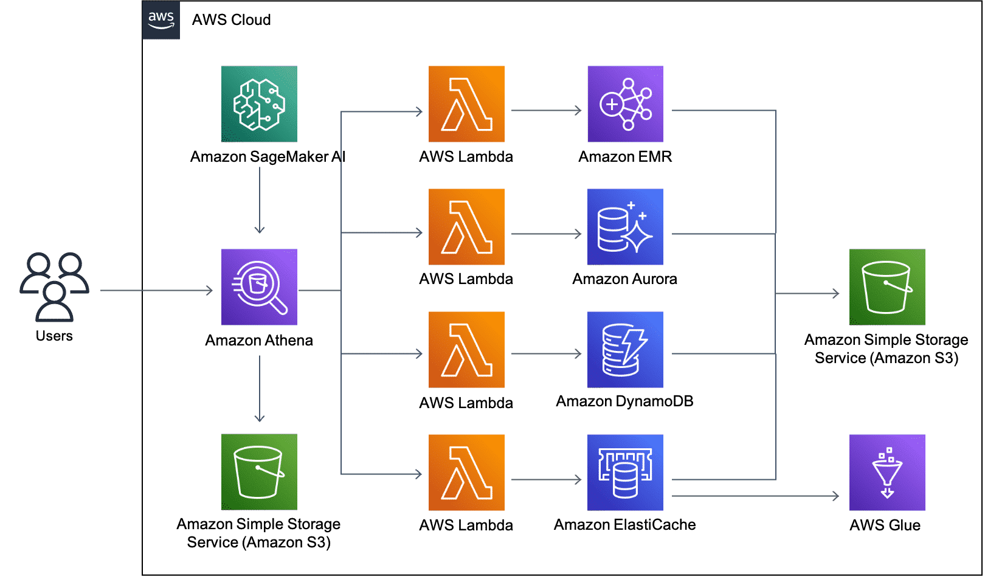

# What is Amazon Athena?

Athena is an interactive query service that facilitates analyzing data in Amazon S3 using standard SQL. Athena is serverless, so there is no infrastructure to manage, and you pay only for the queries that you run.

Athena is straightforward to use. Point to your data in Amazon S3, define the schema, and start querying using standard SQL. Most results are delivered within seconds. With Athena, there’s no need for complex ETL jobs to prepare your data for analysis. This helps anyone with SQL skills to quickly analyze large-scale datasets.

## Pay per query

With Athena, you pay only for the queries that you run. You are charged $5 per terabyte scanned by your queries. You can save from 30 percent to 90 percent on your per-query costs and get better performance by compressing, partitioning, and converting your data into columnar formats. Athena queries data directly in Amazon S3. There are no additional storage charges beyond S3.

## Open, powerful, standard

Athena uses Presto with ANSI SQL support and works with a variety of standard data formats, including CSV, JSON, ORC, Avro, and Parquet. Athena is ideal for quick, one-time querying but it can also handle complex analysis, including large joins, window functions, and arrays. Athena is highly available and runs queries using compute resources across multiple facilities and devices in each facility. Athena uses Amazon S3 as its underlying data store, making your data highly available and durable.

## Fast...really fast

With Athena, you don't have to worry about having enough compute resources to get fast, interactive query performance. Athena automatically runs queries in parallel, so most results come back within seconds.

## Use Case: Building for Athena Federated Query

On major use case for Amazon Athena is using Athena Federated Query so customers can submit a single SQL query and analyze data from multiple sources running on-premises or hosted on the cloud. Athena runs federated queries using data source connectors that run on AWS Lambda. AWS has open-sourced Athena data source connectors for Amazon DynamoDB, Apache HBase, Amazon DocumentDB (with MongoDB compatibility), Amazon Redshift, Amazon CloudWatch Logs, Amazon CloudWatch Metrics Insights, and JDBC-compliant relational data sources such MySQL and PostgreSQL under the Apache 2.0 license. To learn more about this sample architecture, choose each of the five numbered markers.

### Athena Federated Query
Federated Query is an Athena feature that can use SQL queries across data stored in relational, nonrelational, object, and custom data sources. With Athena Federated Query, a single SQL query can be submitted and analyzed from multiple sources running on-premises or hosted on the cloud.

In this architecture, users submit a query using Athena Federated Query. Amazon SageMaker also runs automated queries. Those queries are then sent to an Amazon S3 bucket for data to be analyzed.

### AWS Lambda
Lambda lets you run code without provisioning or managing servers.

In this architecture, the Federated Queries run on Athena will first go through Lambda functions. The Lambda functions act as a data source connector. You can think of a connector as an extension of the Athena query engine. These connectors are each associated with a database and tell Athena which tables need to be read, manage parallelism, and push down filter predicates.

### AWS services
In this architecture, by using the data connectors from the Lambda functions, each of these databases can be queried using Athena Federated Query.

### AWS Glue
AWS Glue is a fully managed ETL service that makes it straightforward and cost-effective to categorize data, clean it, enrich it, and move it reliably between various data stores and data streams.

In this architecture, because Redis doesn’t have a schema of its own, an AWS Glue database and tables need to be set up so the data can be associated to the schema used in the Athena Federated Query.

### Amazon S3
Amazon S3 is a file repository.

In this architecture, the responses from the queries are sent and stored in an S3 bucket as a spill-over.