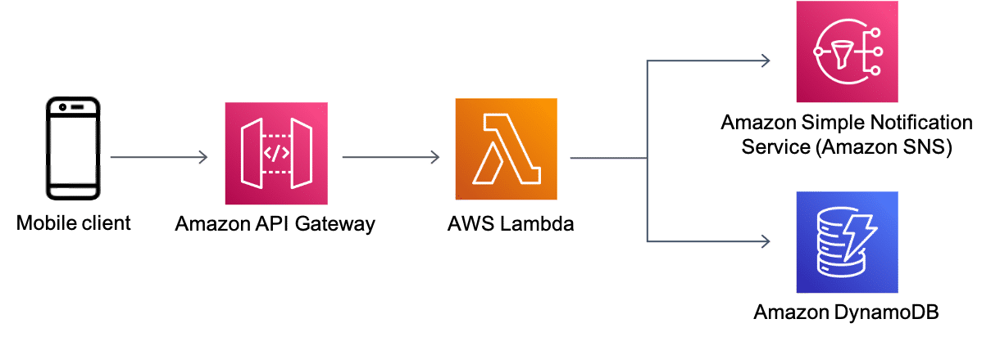
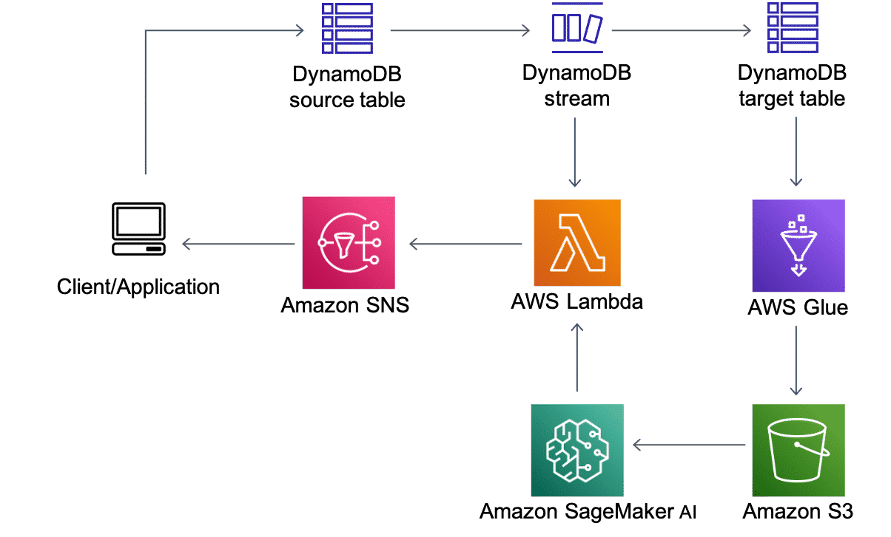

# What is DynamoDB?

DynamoDB is a fully managed, serverless, key-value, NoSQL database designed to run high-performance applications at any scale. DynamoDB offers built-in security, continuous backups, automated multi-Region replication, in-memory caching, and data export tools.

## Use Case: Mobile application backend architecture
Social mobile applications are more popular than ever. This architecture provides one solution for this use case, allowing a mobile application to automatically notify a user’s friends when the user’s status changes. For more information, choose each five numbered markers.

### Mobile client
Within the mobile application, the user can update their status.

### Amazon API Gateway
API Gateway is a service through which developers can create, publish, maintain, monitor, and secure APIs at any scale.

In this architecture, API Gateway is called when the user updates their status.

### AWS Lambda
With Lambda, you can run code, called functions, without provisioning or managing servers.

In this architecture, the call made to the API Gateway initiates a Lambda function. The function runs code to look up the friend list in a DynamoDB table and then push status notifications to the user’s friends using Amazon Simple Notification Service (Amazon SNS).

### Amazon DynamoDB
In this architecture, DynamoDB stores the friend list for every user of the application.

### Amazon Simple Notification Service (Amazon SNS)
Amazon SNS is a messaging service.

In this architecture, Amazon SNS pushes the message, which comes from the Lambda function, to the user’s list of friends.

## Use Case: Anomaly detection on Amazon DynamoDB Streams
A DynamoDB stream is an ordered flow of information about changes to items in a DynamoDB table. When you turn on a stream on a table, DynamoDB captures information about every modification to data items in the table. You can use DynamoDB streams along with Amazon Web Service (AWS) machine learning tools to search and find anomalies in your data and be notified quickly. The following architecture is one example of this use case. We won't go into strong explanations of this architecture in this course, as we will only cover the fundamental thought behind it. You can check out the Anomaly detection on Amazon DynamoDB Streams using the Amazon SageMaker AI Random Cut Forest algorithm(opens in a new tab) blog for a more detailed explanation. To learn how this architecture works, choose each of the five numbered markers.

### DynamoDB stream
Source DynamoDB captures changes and stores them in a DynamoDB stream.

### AWS Glue
The AWS Glue job regularly retrieves data from a DynamoDB target table and runs a training job using Amazon SageMaker to create or update model artifacts on Amazon S3.

### Amazon SageMaker
The same AWS Glue job deploys the updated model on the Amazon SageMaker endpoint for real-time anomaly detection based on Random Cut Forest.

### Lambda
The Lambda function polls data from the DynamoDB stream and invokes the Amazon SageMaker endpoint to get inferences.

### Amazon SNS
The Lambda function alerts user applications after anomalies are detected.