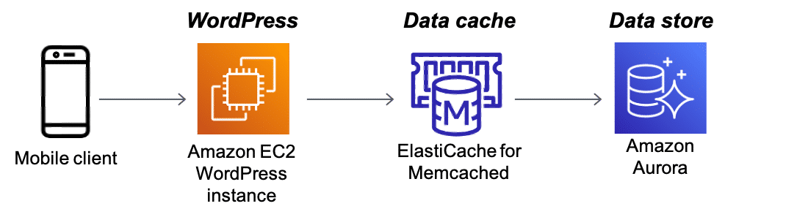
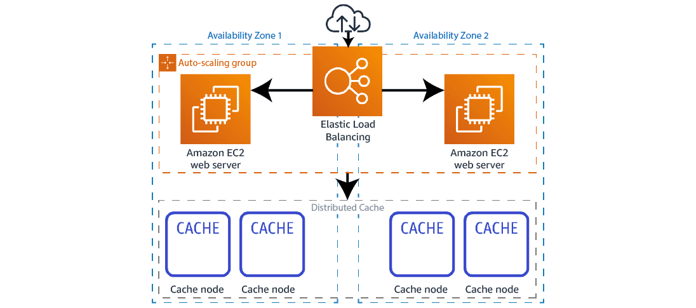

# What is Amazon ElastiCache?
ElastiCache offers fully managed Redis and Memcached distributed memory caches. Seamlessly deploy, run, and scale popular open source-compatible, in-memory data stores. Build data-intensive apps or improve the performance of your existing apps by retrieving data from high throughput and low latency in-memory data stores.

## Use Case: WordPress database cache architecture
When database access is causing performance problems for an application, an in-memory cache can improve latency, increase throughput, and ease the load on the database. For this use case, this architecture is one way you can serve cached items in less than a millisecond and scale cost effectively. For more information, choose each of the three numbered markers.

### Amazon EC2
Amazon EC2 is a web service that provides secure, resizable compute capacity in the cloud. It is designed to make web-scale cloud computing easier for developers.

### ElastiCache for Memcached
ElastiCache for Memcached serves as a tier between Amazon EC2 and the database storing the data for the website.

In this architecture, the database is Aurora. ElastiCache holds a copy of data retrieved from the database for the specified period of time. The only time the database is accessed is when noncached data is required.

### ElastiCache for Memcached
ElastiCache for Memcached serves as a tier between Amazon EC2 and the database storing the data for the website.

In this architecture, the database is Aurora. ElastiCache holds a copy of data retrieved from the database for the specified period of time. The only time the database is accessed is when noncached data is required.

### Amazon Aurora
Aurora is a relational database built for the cloud that combines the performance and availability of traditional enterprise databases with the simplicity and cost-effectiveness of open-source databases.

In this architecture, Aurora stores all of the data for the website.

## Use Case: Scalable distributed cache architecture
To address scalability and provide a shared data storage for sessions that can be accessible from any individual web server, you can abstract the HTTP sessions from the web servers themselves by storing them in a remote cache like ElastiCache. This architecture shows one way to accomplish this use case. For more information, choose each of the three numbered markers.

### Elastic Load Balancing
ELB automatically distributes incoming application traffic across multiple targets, such as Amazon EC2 instances.

In this architecture, ELB distributes traffic between the Amazon EC2 web server

