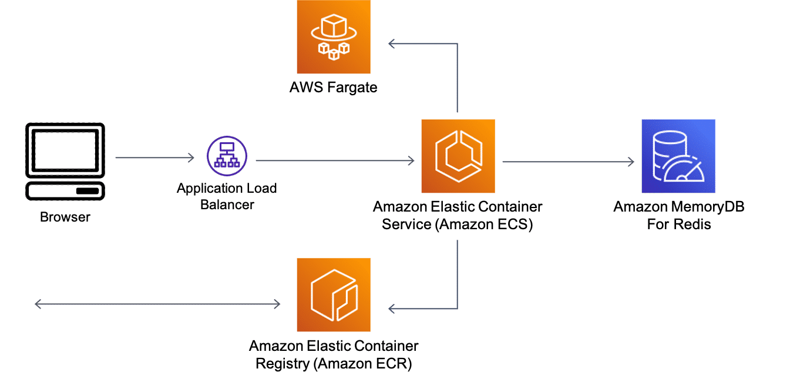

# What is MemoryDB?
Amazon MemoryDB for Redis is a Redis-compatible, durable, in-memory database service that delivers ultra-fast performance. It is purpose-built for modern applications with microservices architectures.

MemoryDB is compatible with Redis, a popular open-source data store, giving customers the ability to quickly build applications using the same flexible and friendly Redis data structures, application programming interfaces (APIs), and commands that they already use today. With MemoryDB, all your data is stored in memory, so you can achieve microsecond read and single-digit millisecond write latency and high throughput. MemoryDB also stores data durably across multiple Availability Zones using a distributed transactional log to facilitate fast failover, database recovery, and node restarts. Delivering both in-memory performance and Multi-AZ durability, Amazon MemoryDB can be used as a high-performance primary database for your microservices applications, eliminating the need to separately manage both a cache and durable database.

## Build web and mobile applications
Use versatile Redis data structures such as streams, lists, and sets to build content data stores, chat and message queues, and geospatial indexes for demanding, data-intensive web and mobile applications that require low latency and high throughput.

## Quickly access customer data for retail
Deliver personalized customer experiences and manage user profiles, preferences, and inventory tracking and fulfillment with microsecond read and single-digit millisecond write latency.

## Develop online games
Build player data stores, session history, and leaderboards for gaming applications that require massive scale, low latency, and high concurrency to make real-time updates.

## Stream media and entertainment
Run high-concurrency streaming data feeds to ingest user activity and support millions of requests per day for media and entertainment applications.

## Use Case: Redis data structures for microservices
Redis is an extremely popular choice for low-latency, high-throughput requirements within containerized workloads. Redis has become a preferred in-memory layer for many enterprise organizations and startups. This post is an example of this use case. Here, Python microservices on Amazon ECS and MemoryDB for Redis as the backend primary database. To learn more about how this architecture works, choose each of the six numbered markers.

### Application Load Balancer
A load balancer serves as the single point of contact for clients.

In this architecture. Cliens access the application from a browser. The Application Load Balancer is the first step in the architecture. From their data is sent to application containers.

### Amazon Elastic Container Service (Amazon ECS)
Amazon Elastic Container Service (Amazon ECS) is a highly scalable and fast container management service.

In this architecture. Container-based microservices are deployed to Amazon ECS

### AWS Fargate
AWS Fargate is a serverless, pay-as-you-go compute engine that lets you focus on building applications without managing servers.

In this architecture. AWS Fargate is used to help create and update applications that need to be built.

### Amazon Elastic Container Registry (Amazon ECR)
Amazon ECR is a fully managed container registry offering high-performance hosting, so you can reliably deploy application images and artifacts anywhere.

In this architecture. The application code is deployed into container images and hosted in Amazon Elastic Container Registry (Amazon ECR) and configured using an ECS task definition.

### Amazon MemoryDB for Redis
AWS Fargate is a serverless, pay-as-you-go compute engine that lets you focus on building applications without managing servers.

In this architecture. The microservices interact with MemoryDB for Redis using the open-source redis-py-cluster Redis cluster aware client. The application code also uses Flask to configure a simple API. Although the application is built using a shared MemoryDB for Redis cluster, microservices patterns allow independent clusters to be used in a database-per-service model. MemoryDB for Redis supports ACLs which can restrict user access to certain keys, and commands based on an access string.

