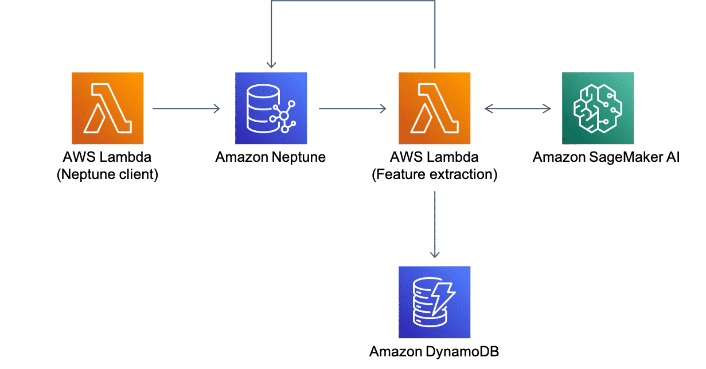
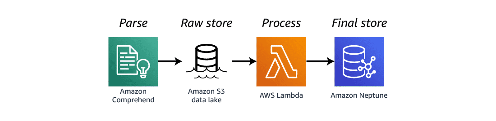

# Understanding graph relationships
Suppose you wanted to look at a product or social recommendation. In the following diagram, notice Diego at the top right. The graph shows that Diego knows Liu and Mary. Graph databases, like all others, can store information on many different entities. Entities are called nodes in a graph database. Diego, Liu, and Shirley represent customer nodes. The relationship between two nodes is known as an edge.

A graph database can have multiple types of nodes. Notice the product node at the top of the graph. This node tracks purchase history. Three customers purchased this particular product.

You can go a step further and track customer interests, such as a favorite sport. This graph provides analysts with an opportunity to answer helpful questions. Richard may be interested in products that were purchased by other customers who like sports. Liu might be interested to know about the other customers that his friends know.

## Use Case: Amazon Neptune with Amazon SageMaker AI to detect fraud
Using graph databases, like Amazon Neptune, can help with fraud detection. When running an application that allows payments between clients and devices, you'll want to ensure fraud detection. Multiple senders sharing a pot of identity information and sending payments to the same recipient is a common pattern of fraudulent or illegal behavior. Using Amazon Neptune with Amazon SageMaker AI, you can utilize the power of graph databases and machine learning to automate and quickly notice this type of behavior. See the example below for one way this can be done. For more information, choose each of the five numbered markers.

### AWS Lambda (Neptune client)
With Lambda, you can run code, called functions, without provisioning or managing servers.

In this architecture, AWS Lambda takes all payments and writes them to Amazon Neptune.

### Amazon Neptune
In this architecture, Amazon Neptune takes the data received from AWS Lambda and stores it. It then publishes this same data to Neptune streams, which is then received by another AWS Lambda.

### AWS Lambda (Feature extraction)
With Lambda, you can run code, called functions, without provisioning or managing servers.

In this architecture, AWS Lambda (Feature extraction) does a few steps in this architecture. Firstly, it queries the data streamed to it from Amazon Neptune. It then sends the data to Amazon SageMaker. Amazon SageMaker then gives the payment a "score" using Machine Learning to find signs of fraud. AWS Lambda then takes that score and stores in on Amazon DynamoDB.

### Amazon SageMaker
Amazon SageMaker uses a broad set of capabilities purpose-built for machine learning.

In this architecture, Amazon SageMaker receives data from AWS Lambda and automates detection of suspicious transactions quickly and gives each payment a "score" which is then sent to back to AWS Lambda.

### Amazon DynamoDB
Amazon DynamoDB is a fully-managed key-value nonrelational database.

In this architecture, Amazon DynamoDB stores the scores received from AWS Lambda and Amazon SageMaker.

## Use Case: RSS keyword capture architecture
Machine learning technologies are becoming more common in many business solutions. This architecture shows one way you can use Amazon Comprehend to gather important information from an RSS feed and store that information in a Neptune database. For more information, choose each of the four numbered markers.

### Amazon Comprehend
Amazon Comprehend is a natural language processing (NLP) service that uses machine learning to find insights and relationships in text.

In this architecture, Amazon Comprehend is used to gather keywords from the feed and then load them into an Amazon S3 bucket.

### Amazon S3 data lake
An S3 data lake is a storage location for many types of data.

In this architecture, it stores all the data gathered by Amazon Comprehend.

### AWS Lambda
With Lambda, you can run code without provisioning or managing servers.

In this architecture, the Lambda function gathers data from the S3 data lake and loads it into the Neptune database on a scheduled basis.

### Amazon Neptune
In this architecture, Neptune serves as the final repository for all of the keywords gathered from the RSS feeds.