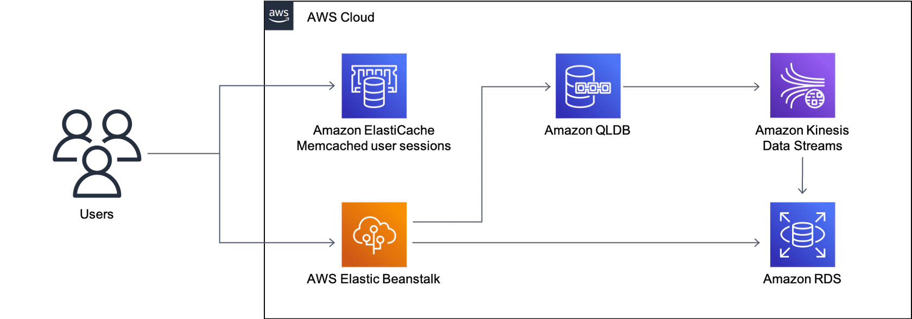

# What is Amazon QLDB?

Amazon Quantum Ledger Database (Amazon QLDB) is a fully managed ledger database that provides a transparent, immutable, and cryptographically verifiable transaction log ‎owned by a central trusted authority. Amazon QLDB tracks each and every application data change and maintains a complete and verifiable history of changes over time.

## Use Case: Delivering cryptographically secure and verifiable medical data
Many medical companies use Amazon QLDB to maintain a system of records. Amazon QLDB is not as optimized as other databases for one-time searches, analytics, and reporting, although these are possible. The following is a sample architecture used to create successful transactions using Amazon QLDB. Transactions are then streamed using Amazon Kinesis Data Streams to an Amazon RDS PostgreSQL database. To learn more about how this architecture works, choose each of the five numbered markers.

### Amazon ElastiCache Memcached user sessions
ElastiCache for Memcached is a Memcached-compatible in-memory key-value store service that can be used as a cache or a data store. It delivers the performance, ease-of-use, and simplicity of Memcached.

In this architecture, ElastiCache caches user session data to provide near real-time response times.

### AWS Elastic Beanstalk
Elastic Beanstalk is a service used for deploying and scaling web applications and services developed with Java, .NET, PHP, Node.js, Python, Ruby, Go, and Docker on familiar servers such as Apache, Nginx, Passenger, and IIS.

In this architecture, Elastic Beanstalk deploys and runs the frontend and application logic.  It offloads the operational work of deployment, patching, and scaling.

### Amazon QLDB
In this architecture, Amazon QLDB is used to maintain and store an unfalsifiable, and cryptographically verifiable record of medical histories, and for clinic pharmacy usage and stocking. Successful transactions are streamed to an Amazon RDS database for searching and analytics.

### Amazon Kinesis Data Streams streaming transaction data
Kinesis Data Streams is a serverless streaming data service that facilitates capturing, processing, and storing data streams at any scale.

In this architecture, data is sent from QLDB and then exported by near real-time streaming to an Amazon RDS database, where data can be queried.

### Amazon RDS - PostgreSQL staged data
Amazon RDS is a relational database.

In this architecture, because Amazon QLDB is not optimized for ad-hoc search, reporting, and analytics, successful transactions are placed into an Amazon RDS database instead. Amazon QLDB remains the database used for a system of record.