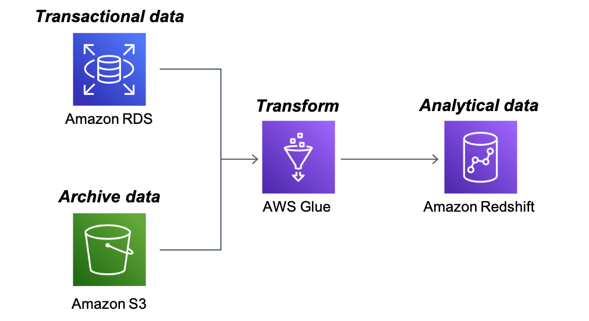
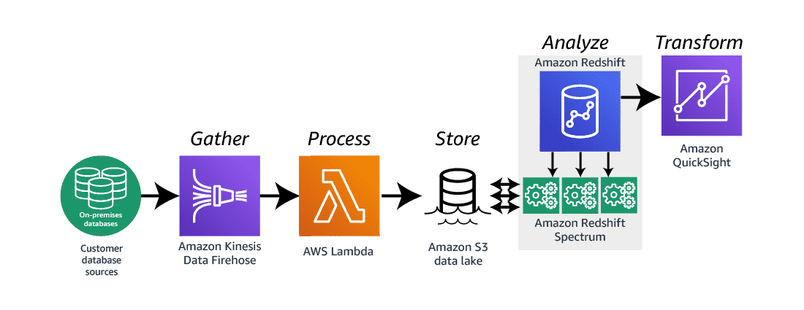

# What is Amazon Redshift?
Amazon Redshift is a fast, scalable data warehouse that makes it simple and cost effective to analyze all your data across your data warehouse and data lake. Amazon Redshift uses machine learning, massively parallel query execution, and columnar storage on high-performance disk.

## Use Case: Rich data platform architecture
Amazon Redshift is a perfect repository for analytical data. The question becomes how to get quality data into the database with speed, efficiency, and accuracy. To solve this use case, one option is to use this architecture for building out a rich data platform pulling data from multiple data sources. To learn more about this architecture, choose each of the four numbered markers.

### Amazon Relational Database Service (Amazon RDS)
Amazon RDS is a web service that facilitates setting up, operating, and scaling a relational database in the cloud.

In this architecture, the Amazon S3 bucket contains archived data from hundreds of data repositories.

### Amazon S3
Amazon S3 is a data repository.

In this architecture, Amazon RDS houses a large volume of transactional data that is vital to the analytical processes of the business.

### AWS Glue
AWS Glue is a fully managed extract, transform, and load (ETL) service that helps customers prepare and load their data for analytics.

In this architecture, AWS Glue is pulling data from both Amazon RDS and Amazon S3, transforming the data into analytical results, then loading those results into the Amazon Redshift data warehouse.

### Amazon Redshift
In this architecture, Amazon Redshift is the final repository for the analytical data. Services such as Amazon QuickSight can access the repository for visualization and analysis of the data.

## Use Case: Event-driven data analysis architecture
With the speed of data generation increasing all the time, the speed of data analysis and reporting must increase at the same pace. This architecture is one way to solve this use case. It is used to create an event-driven data analysis solution. To learn more about this architecture, choose each numbered marker.

### Amazon Kinesis Data Firehose
Kinesis Data Firehose is a service that captures, transforms, and loads data into storage services such as Amazon S3.

In this architecture, Kinesis Data Firehose gathers data from on-premises data servers. This process initiates a Lambda function.

### AWS Lambda
Lambda lets you run code without provisioning or managing servers.

In this architecture, the Lambda function takes the data from the Kinesis Firehose stream and loads it into an Amazon S3 data lake.

### Amazon S3 data lake
An Amazon S3 data lake is a storage location for many types of data.

In this architecture, it stores all the data gathered by Kinesis Data Firehose.

### Amazon Redshift Spectrum
Amazon Redshift Spectrum efficiently queries and retrieves structured and semi-structured data from files in Amazon S3 without having to load the data into Amazon Redshift tables.

In this architecture, Amazon Redshift Spectrum is used to query both the data within the Amazon Redshift tables and the data gathered from the Lambda function.

### Amazon Redshift
In this architecture, the Amazon Redshift cluster has already been loaded with analytical data.

### Amazon QuickSight
QuickSight is a fast, cloud-powered business intelligence service that facilitates delivering insights to everyone in your organization.

In this architecture, QuickSight uses the Amazon Redshift cluster as a data source. The reports and dashboard written in QuickSight can refresh and load all new records in real time.
