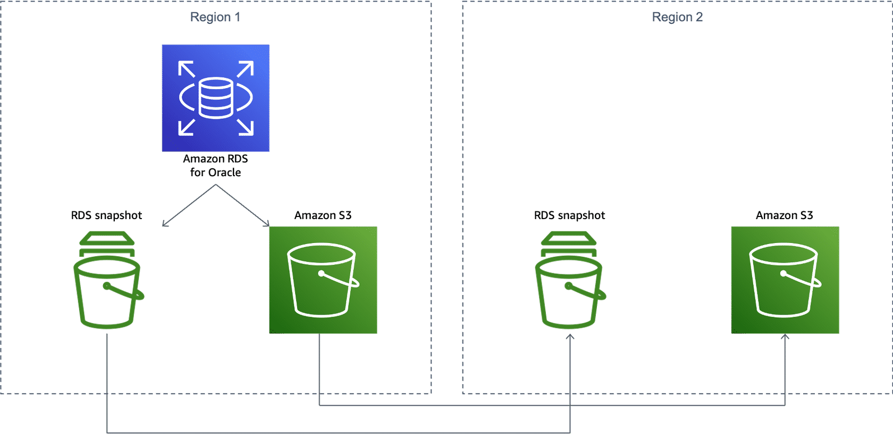
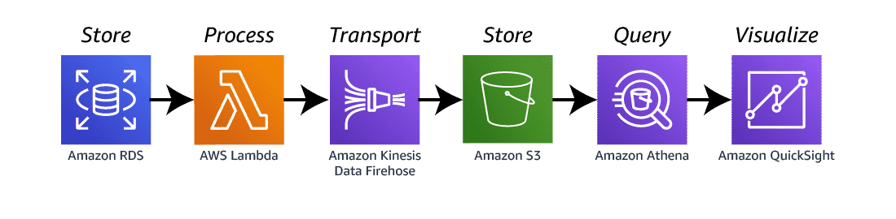

# Amazon Relational Database Service (Amazon RDS)

## What is Amazon RDS?
Amazon Relational Database Service (Amazon RDS) makes it easy to set up, operate, and scale a relational database in the cloud. It provides cost-efficient and resizable capacity while automating time-consuming administration tasks, such as hardware provisioning, database setup, patching, and backups. It frees you to focus on your applications so you can give them the fast performance, high availability, security, and compatibility they need.

Amazon RDS database engines include:
* Amazon Aurora 
* PostgreSQL 
* MySQL 
* MariaDB 
* Oracle Database 
* Microsoft SQL Server

### Use Case: Disaster recovery architecture
Amazon RDS for Oracle commonly runs mission-critical databases as mentioned in the preceding video. If anything were to happen to these databases, it would be devastating. In this use case, the architecture is showing one option for creating a disaster recovery solution for the databases. It utilizes cross-Regional automated backups. For more information, choose each of the 5 numbered markers.

#### Amazon RDS for Oracle
In this architecture, Amazon RDS for Oracle automatically creates snapshots, which are stored in an Amazon Simple Storage Service (Amazon S3) bucket.

#### RDS snapshot 1
RDS snapshots are storage volumes of your database (DB) instance at a specific time. This is a backup of the entire DB instance and not just individual databases.

In this use case, the RDS snapshot is automatically replicated into a second Region. This way, your database can be quickly spun up in the secondary Region based on the backups already there, quickly reducing downtime.

#### Amazon S3 bucket 1
Amazon S3 is a file repository.

In this architecture, it stores the archived redo logs of the database. This is automatically replicated into a secondary Region.

#### RDS snapshot 2
RDS snapshots are storage volumes of your DB instance at a specific time. This is a backup of the entire DB instance and not just individual databases.

In this architecture, this is a replicated RDS snapshot from your primary Region. This snapshot can be used to create a new database in this Region, should the primary Region fail, or should you need to scale.

#### Amazon S3 bucket 2
Amazon S3 is a file repository.

In this architecture, this is a replicated S3 bucket storing archived redo logs from your primary Region. This can be used to create a new database in this Region, should the primary Region fail, or should you need to scale.

### Use Case: Real-time data analytics architecture
When real-time data analytics are run directly against the Amazon RDS database, it can cause latency. For this use case, one solution is to create an architecture that moves these records off the database for analysis. For more information, choose each of the 6 numbered markers.

#### Store
In this architecture, Amazon RDS databases can use stored procedures to integrate with Lambda functions. The stored procedure in this architecture is configured to execute whenever a new record is inserted in the sales table.

#### Process
Lambda lets you run code without provisioning or managing servers.
In this architecture, the Lambda function gathers the newly added record from the Amazon RDS stored procedure and passes it on to Amazon Kinesis Data Firehose.

#### Transport
Kinesis Data Firehose is a service that captures, transforms, and loads data into storage services such as Amazon S3 data lakes.
In this architecture, the data received by Kinesis Data Firehose is sent to an Amazon S3 bucket for analysis.

#### Store
Amazon S3 is a file repository.
In this architecture, it stores all records that are added to the sales table.

#### Query
Athena is an interactive query service that streamlines analyzing data in Amazon S3.
In this architecture, Athena is used to execute queries against all the records in the Amazon S3 bucket in real time.

#### Visualize
QuickSight is a fast, cloud-powered business intelligence service that facilitates delivering insights to everyone in your organization.

In this architecture, QuickSight uses the results of Athena queries to build reports and dashboards. QuickSight can refresh and load all new records in real time.