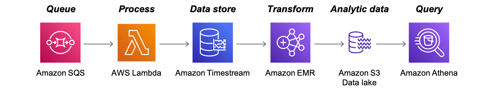

# What is Amazon Timestream?
Amazon Timestream is a fast, scalable, and serverless time-series database service for Internet of Things (IoT) and operational applications that makes it easy to store and analyze trillions of events per day. Timestream saves you time and cost in managing the lifecycle of time-series data by keeping recent data in memory and moving historical data to a cost-optimized storage tier based upon user-defined policies.

With the Timestream purpose-built query engine, you can access and analyze recent and historical data together, without needing to specify explicitly in the query whether the data resides in the in-memory or cost-optimized tier. Timestream has built-in time-series analytics functions, helping you identify trends and patterns in your data in near real time. Timestream is serverless and automatically scales up or down to adjust capacity and performance, so you don’t need to manage the underlying infrastructure, freeing you to focus on building your applications.

## High performance at low cost
Timestream is designed to facillitate interactive and affordable real-time analytics. With product features such as scheduled queries, multi-measure records, and data storage tiering, you can process, store, and analyze your time-series data at a fraction of the cost of existing time-series solutions. Timestream can help you derive faster and more-affordable insights from your data so you can continue to make more data-driven business decisions.

## Serverless with auto scaling
Timestream is serverless—there are no servers to manage and no capacity to provision, so you can focus on building your applications. Timestream gives you the scale to process trillions of events and millions of queries a day. As your application needs change, it automatically scales to adjust capacity.

## Data lifecycle management
Timestream simplifies the complex process of data lifecycle management. It offers storage tiering, with a memory store for recent data and a magnetic store for historical data. Timestream automates the transfer of data from the memory store to the magnetic store based on user-configurable policies.

## Simplified data access
With Timestream, you no longer need to use disparate tools to access recent and historical data. The Timestream purpose-built query engine transparently accesses and combines data across storage tiers without you having to specify the data location.

## Purpose-built for time series
You can quickly analyze time-series data using SQL, with built-in time-series functions for smoothing, approximation, and interpolation. Timestream also supports advanced aggregates, window functions, and complex data types such as arrays and rows.

## Always encrypted
Timestream ensures that your time-series data is always encrypted, whether at rest or in transit. With Timestream, you also can specify an AWS Key Management Service (AWS KMS) customer managed key for encrypting data in the magnetic store.

## Use Case: IoT sensor data capture architecture
Capturing data from thousands of IoT sensors can be a challenge. For this use case, this architecture represents one solution to this challenge. For more information, choose each of the six numbered markers.

### Amazon Simple Queue Service (Amazon SQS)
Amazon SQS is a message queuing service.

In this architecture, many IoT devices send messages to the Amazon SQS service.

### AWS Lambda
With Lambda, you can run code, called functions, without provisioning or managing servers.

In this architecture, Amazon SQS receives a new message, which initiates a Lambda function. The function loads the message into a Timestream table.

### Amazon Timestream
In this architecture, Timestream serves as a first-stage repository for all messages sent to the Amazon SQS queue.

### Amazon EMR
Amazon EMR is a service that is used to gather, process, and load data for the purpose of data analytics and storage.

In this architecture, Amazon EMR gathers data from Timestream, processes it, then stores it in an S3 data lake.

### Amazon Simple Storage Service (Amazon S3) data lake
An Amazon S3 data lake is a storage location for many types of data.

In this architecture, it stores the processed data from Amazon EMR.

### Amazon Athena
Athena is an interactive query service that streamlines analyzing data in Amazon S3 using standard SQL.

In this architecture, you can use Athena to query the data now stored in the S3 data lake.