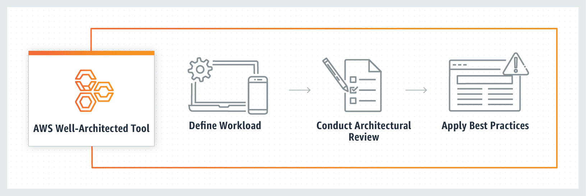

# What is the AWS Well-Architected Tool?

The AWS Well-Architected Tool is a service offered which can be accessed within the console. It provides a consistent process for measuring your architecture using AWS best practices.

## Benefits
* Get architectural guidance.
* Review your workloads consistently.
* Identify and implement improvements.
* Customize your review.

## How it works

* Step 1: Define workload
  * Workloads can be simple, such as a static website, or complex, such as microservices architectures with multiple data stores and many components.

* Step 2: Conduct architectural review
  * Review your workloads against AWS best practices by answering a set of foundational questions, with the option to create your own custom lens.

* Step 3: Apply best practices
  * The AWS WA Tool delivers a list of issues found in your workloads and step-by-step guidance to make improvements.

In addition to the design principles found within the AWS Well-Architected Framework and its six pillars, you can use custom lenses to measure your workload using your own best practices. You can tailor the questions in a custom lens to be specific to a particular technology or to help you meet the governance needs within your organization. Custom lenses extend the guidance provided by the AWS lenses.

This service is intended for those involved in technical product development, such as chief technology officers (CTOs), architects, developers, and operations team members. AWS customers use the AWS Well-Architected Tool to document their architectures, provide product launch governance, and understand and manage the risks in their technology portfolio.