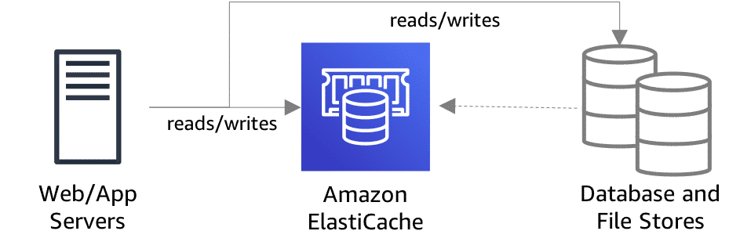
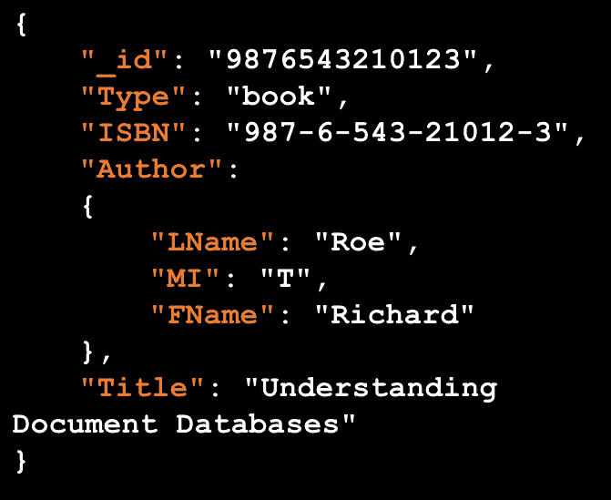

# Choosing the right database

Now that you have a sound understanding of the database services offered by Amazon Web Service (AWS), take a look at the
use cases below. For each use case, you will first see a business challenge. After reading the business challenge, see
if you can guess which AWS Database service should be used. Then choose the AWS solution tab to see if you got it right!

## Business Challenge1

### Business Challenge

A business is currently running their inventory management on premises, but is looking to move into the cloud for
increased performance and scalability.

"I have an inventory control system that needs to be migrated to a relational database in the cloud. What should I use?"

### AWS Solution

For online transaction processing, or OLTP, and online analytical processing, or OLAP, databases using row-based
indexing, we have Amazon Relational Database Service, also called Amazon RDS. Now, this service streamlines setting up,
operating, and scaling a relational database in the cloud. The service provides cost-efficient and scalable capacity
while automating many time-consuming administration tasks, such as hardware provisioning, database setup, patching, and
backups.

## Business Challenge2

### Business Challenge

A business running a gaming website is noticing that their database is running slowly because of how rapidly they are
growing.

"I have a gaming website that has grown so quickly that the whole site loads slowly. I need a solution that can handle
this huge volume of uses. What should I use?"

### AWS Solution

You can use Amazon ElastiCache to support data-intensive apps or improve the performance of your existing apps by
retrieving data from high throughput and low latency in-memory data stores. This service offers fully managed Redis and
Memcached cache engines for in-memory data stores. ElastiCache is a popular choice for gaming, advertising technology (
ad tech), financial service, healthcare, and Internet of Things (IoT) apps.

On the surface, the Redis and Memcached engines look similar. Each is an in-memory
key-value store. However, there are significant differences between the two. Requirements such as compliance, backup and
replication, and automatic failover dictate which engine you should implement. For the full list of differences, see
Comparing Memcached and Redis(opens in a new tab).(opens in a new tab)

With both ElastiCache for Redis and ElastiCache for Memcached, you:

* No longer need to perform management tasks such as hardware provisioning, software patching, setup, configuration, and
  failure recovery
* Have access to monitoring metrics so you can diagnose and react to issues quickly
* Can take advantage of cost-efficient and resizable hardware capacity

## Business Challenge3

### Business Challenge

A business needs a solution that lets database engineers focus their time on customer-facing features instead of routine
database maintenance and administration.

"My PostgreSQL database is seeing a lot of write I/Os smaller than 4 KB. We're consuming a good amount of I/O resources.
What should I use?"

### AWS Solution

Amazon Aurora is a relational database engine managed by Amazon Relational Database Service, or Amazon RDS. Aurora
combines the speed and reliability of high-end commercial databases with the simplicity and cost-effectiveness commonly
associated with open-source databases. Aurora is designed to eliminate unnecessary input/output operations to reduce
costs and ensure that resources are available for serving read/write traffic.

## Business Challenge4

### Business Challenge

A business needs a database that can rapidly gather customer data.

"I need to quickly gather shopping cart data from my website and discard data on abandoned carts. What should I use?"

### AWS Solution

Amazon DynamoDB can handle more than 10 trillion requests per day and support peaks of more than 20 million requests per
second. More than 100,000 AWS customers have chosen DynamoDB as their key-value database for mobile, web, gaming, ad
tech, IoT, and other applications that need low-latency data access at any scale. DynamoDB supports ACID-compliant (
atomicity, consistency, isolation, durability) transactions.

Amazon DynamoDB is a fully managed key-value and document store database. It delivers single-digit millisecond
performance at any scale. It offers built-in security, continuous backups, automated multi-Region replication, in-memory
caching, and data export tools.

## Business Challenge5

### Business Challenge

A business needs a way to load data into a warehouse and archive in storage so they can manage costs.

"I need a data warehouse solution that provisions infrastructure capacity and automates ongoing administrative tasks.
What should I use?"

### AWS Solution

Amazon Redshift uses machine learning, massively parallel query execution, and columnar storage on high-performance
disks. You can set up and deploy a new data warehouse in minutes. Run queries across petabytes of data in your Amazon
Redshift data warehouse and exabytes of data directly from your data lake built on Amazon Simple Storage Service (Amazon
S3) with Amazon Redshift Spectrum.

Amazon Redshift is a fast, scalable data warehouse that makes it simple and cost effective to analyze all your data
across your data warehouse and your data lake.

## Business Challenge6

### Business Challenge

A business is working to develop an e-commerce app that specializes in fraud detection. The business needs a solution
that can provide near real-time detection of patterns that are defined as suspicious and indicate known fraud activity.

"I am building a fraud detection app and need a database that supports near real-time detection of patterns.
What should I use?"

### AWS Solution

Amazon Neptune is a fast, reliable, fully managed graph database service that makes it easy to build and run
applications that work with highly connected datasets used to discover potential fraudulent behavior before it happens.
This starts with finding interactions between products, locations, and devices and then mapping those data points to
individual users, customers, or employees.

Neptune graph use cases include recommendation engines, fraud detection, knowledge graphs, drug discovery, and network
security.

Graph databases are purpose built to store any type of data, whether it’s structured, semi-structured, or unstructured.
The purpose for organization in a graph database is to navigate the relationships. Data within the database is queried
using a specific language associated with the software tools you have implemented.

The AWS graph database service is called Amazon Neptune. It’s a fast, reliable, fully managed graph database service
that streamlines building and running applications that work with highly connected datasets.

Graph databases like Amazon Neptune are purpose built to store and navigate relationships. These databases have
advantages over relational databases for use cases such as social networking, recommendation engines, and fraud
detection, where you need to create relationships between the data very quickly, querying these relationships.

## Business Challenge7

### Business Challenge

A business is storing online profiles in which different users provide different types of information. The business is
already using MongoDB, but wants to migrate to the cloud.

"We have a massive MongoDB database that needs to be migrated to the cloud. We need a managed service that is purpose
built for our workload. What should I use?"

### AWS Solution

Amazon DocumentDB (with MongoDB compatibility) is a fast, reliable, and fully managed database service with which you
can set up, operate, and scale MongoDB-compatible databases in the cloud. With Amazon DocumentDB, you can run the same
application code and use the same drivers and tools that you use with MongoDB.

Amazon DocumentDB is used for storing semi-structured data as a document, rather than normalizing data across multiple
tables, each with a unique and fixed structure, as in a relational database. Documents stored in a document database use
nested key-value pairs to provide the document's schema.

The following table compares terminology used by document databases with terminology used by relational databases.

Note: Screen readers should enter table mode to read the following table.

| Relational             | Document          |
|------------------------|-------------------|
| Table                  | Collection        |
| Row                    | Document          |
| Column                 | Field             |
| Primary key            | Object ID         |
| Nested table or object | Embedded document |

The following is a sample book document in a library collection.
