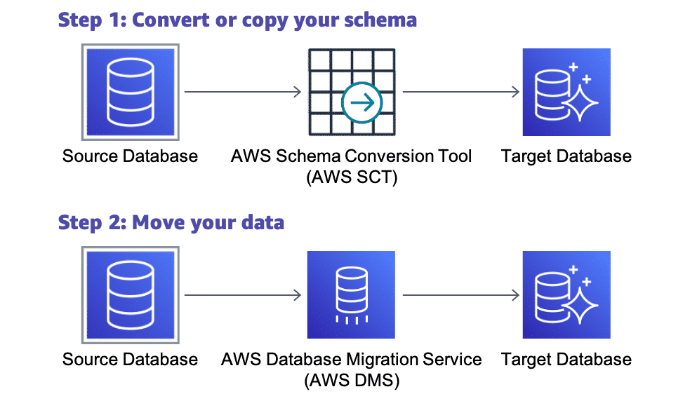

# Database Migration

## Migrating database schemas
There are many different migration strategies. Some common migrations include on-premises databases to the AWS Cloud, relational to nonrelational databases, and databases hosted on Amazon Elastic Compute Cloud (Amazon EC2) to fully managed AWS databases services such as Amazon Aurora. AWS Database Migration Service (AWS DMS) supports homogeneous migrations such as Oracle to Oracle as well as heterogeneous migrations between different database engines, such as Oracle to MySQL.

However, AWS DMS creates only those objects required to efficiently migrate the data. To migrate the remaining database elements and schema, you need to use other tools depending on the type of database migration. For example, if you are migrating an on-premises Microsoft SQL database, you can use native Microsoft SQL tools to migrate the database to Amazon Relational Database Service (Amazon RDS) for Microsoft SQL.

Homogeneous migrations, where you migrate between the same database engines, might require the use of native database tools to migrate database elements.

Heterogeneous migrations, where you migrate between different database engines, such as Oracle to Amazon Aurora, require the use of the AWS Schema Conversion Tool (AWS SCT) to first translate your database schema to the new platform. You can then use AWS DMS to migrate the data. It is important to understand that AWS DMS and AWS SCT are two different tools that serve different needs.

## What is AWS SCT?
The AWS Schema Conversion Tool (AWS SCT) makes heterogeneous database migrations predictable. It does this by automatically converting the source database schema and a majority of the database code objects—including views, stored procedures, and functions—to a format compatible with the target database. Any objects that cannot be automatically converted are clearly marked so that they can be manually converted to complete the migration.

AWS SCT can also scan your application source code for embedded SQL statements and convert them as part of a database schema conversion project. During this process, AWS SCT performs cloud-native code optimization by converting legacy Oracle and Microsoft SQL Server functions to their equivalent AWS service. This helps you modernize the applications at the time of database migration.

## What is AWS DMS?
AWS Database Migration Service (AWS DMS) helps you migrate databases to AWS quickly and securely. The source database remains fully operational during the migration, minimizing downtime to applications that rely on the database. The AWS Database Migration Service can migrate your data to and from the most widely used commercial and open-source databases.

AWS Database Migration Service supports homogeneous migrations such as Oracle to Oracle, as well as heterogeneous migrations between different database platforms, such as Oracle or Microsoft SQL Server to Amazon Aurora. With AWS Database Migration Service, you can also continuously replicate data with low latency from any supported source to any supported target. For example, you can replicate from multiple sources to Amazon Simple Storage Service (Amazon S3) to build a highly available and scalable data lake solution. You can also consolidate databases into a petabyte-scale data warehouse by streaming data to Amazon Redshift.

## How do AWS SCT and AWS DMS work together?
AWS SCT enables you to convert your schema, and AWS Database Migration Service (AWS DMS) will help you migrate the actual data in your database. AWS DMS can do migration in two ways. It can do full-load migration, in which you stop your system and transfer your data all at once. Or it can perform ongoing replication and change data capture, in which you do an initial transfer of data, and then repeatedly transfer changes. This enables you to run the two systems in parallel to ensure the new system works.

