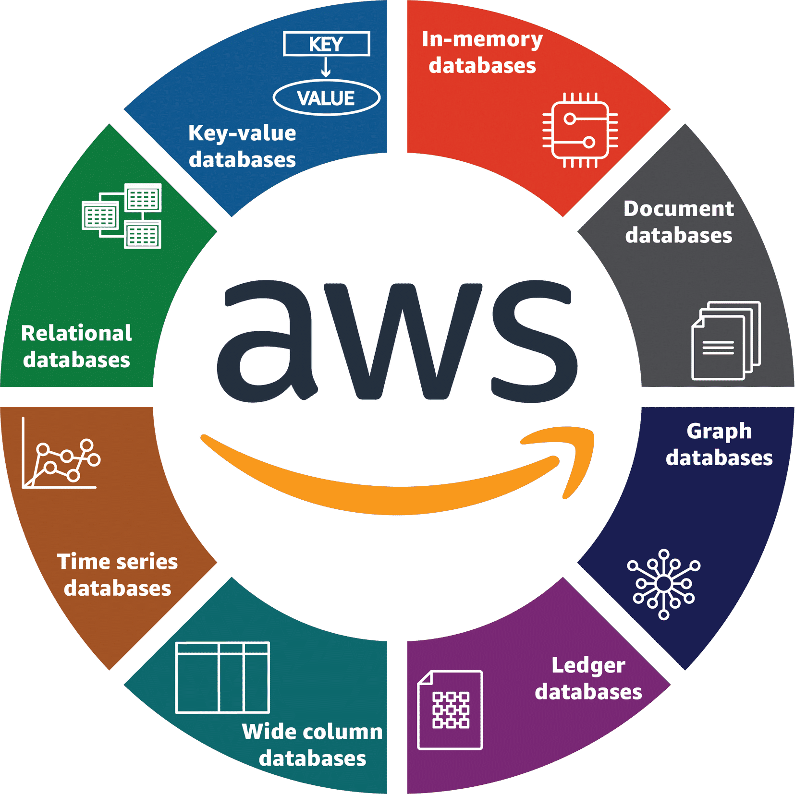

# Database Services Offered by AWS
## The AWS database offerings

The need for a database solution to support distinct use cases and workload profiles is evident in today's world. Amazon Web Service (AWS) offers a broad range of database services that are purpose built for your specific applications. AWS managed database services include relational and nonrelational databases.

### Relational
Relational databases store data with a defined schema. These databases are commonly used for transactional and traditional applications.

### Key-value
Key-value databases are optimized to store and retrieve key-value pairs in large volumes and in milliseconds, without the performance overhead and scale limitations of relational databases.

### In-memory
In-memory databases are used for read-heavy and compute-intensive applications that require low-latency access to data.

### Document
Document databases are designed to store data as documents. Data is typically represented as a readable document.

### Graph
Graph databases are used for applications that need to let users query and navigate relationships between highly connected datasets.

### Ledger
Ledger databases are used to provide transparent, immutable, and cryptographically transaction logs. They are useful for banking transactions, registrations, supply chains, and the like.

### Wide-column
Wide-column databases can have names and formats of the columns that vary across rows, even within the same table. Queries for a particular value in a column are very fast, as the entire column can be loaded and searched quickly.

## AWS service spotlight
### Amazon Relational Database Service (Amazon RDS)
Amazon Relational Database Service (Amazon RDS) is a web service that streamlines setting up, operating, and scaling relational databases in the cloud. With Amazon RDS, you can manage common database administration tasks such as operating system patching, database updates, and backups. Supported database engines include PostgreSQL, MySQL, MariaDB, Oracle, and Microsoft SQL Server.

### Amazon Aurora
Amazon Aurora is part of the managed database service Amazon RDS. Aurora is compatible with MySQL and PostgreSQL. With Aurora, you can combine the performance and availability of traditional enterprise databases with the simplicity and cost effectiveness of open-source databases.

### Amazon DynamoDB
Amazon DynamoDB is a fully managed key-value, nonrelational database service that provides fast and predictable performance with seamless scalability. With DynamoDB, you can create database tables that store and retrieve data and serve any level of request traffic. You can scale up or scale down your tables' throughput capacity without downtime or performance degradation.

### Amazon Keyspaces
Amazon Keyspaces (for Apache Cassandra) is a scalable, highly available, and managed Apache Cassandra–compatible database service. With Amazon Keyspaces, you can run your Cassandra workloads on AWS using the same Cassandra application code and developer tools that you use today.

### Amazon DocumentDB
Amazon DocumentDB (with MongoDB compatibility) is designed from the ground up to give you the performance, scalability, and availability you need when operating mission-critical MongoDB workloads at scale. In Amazon DocumentDB, the storage and compute are decoupled, so each can scale independently.

### Amazon Neptune
Amazon Neptune is a fast, reliable, fully managed graph database service for applications that work with highly connected datasets. Neptune offers read replicas for high availability. You can create point-in-time copies and configure continuous backup to Amazon Simple Storage Service (Amazon S3) with replication across Availability Zones.

### Amazon Timestream
Amazon Timestream is a fast, scalable, fully managed time series database service for Internet of Things (IoT) and operational applications that facilitates storage and analysis of trillions of events per day at one-tenth the cost of relational databases.

### Amazon Quantum Ledger Database (Amazon QLDB)
Amazon Quantum Ledger Database (Amazon QLDB) is a fully managed ledger database. It provides a complete verifiable history of all application data changes and is built with tried and tested technology used inside AWS for years to solve building reliable system-of-record applications at scale.

### Amazon ElastiCache
Amazon ElastiCache offers fully managed Redis and Memcached in-memory data stores. You can build data-intensive apps or improve the performance of your existing apps by retrieving data from high throughput and low latency in-memory data stores.

### Amazon MemoryDB
Amazon MemoryDB for Redis is a Redis-compatible, durable, in-memory database service that delivers ultra-fast performance. It offers fully managed Redis with durability. MemoryDB is purpose built to serve modern microservices applications such as data-intensive real-time apps, mobile and web apps, media and entertainment, gaming, e-commerce and retail, and banking and finance.

### Amazon Redshift
Amazon Redshift is an enterprise-level, petabyte-scale, fully managed data warehousing service. With Amazon Redshift, you can achieve efficient storage and optimum query performance through a combination of massively parallel processing, columnar data storage, and very efficient, targeted data compression encoding schemes.

### Amazon Athena
Amazon Athena is an interactive query service that makes it easy to analyze data in Amazon S3 using standard structured query language (SQL). Athena is serverless, so there is no infrastructure to manage, and you pay only for the queries that you run.