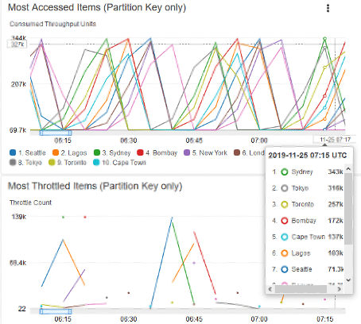
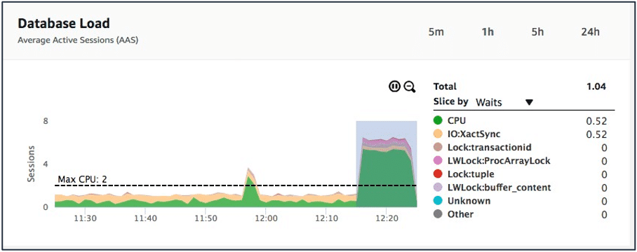

# Designing database solutions for operational excellence

## CloudWatch
CloudWatch is a monitoring and observability service. CloudWatch provides you with data and actionable insights to monitor your databases performance.

### CloudWatch Log
With CloudWatch Logs, you can centralize the logs from all your systems, applications, and AWS services in a single, highly scalable service. You can then view them, search them for specific error codes or patterns, filter them based on specific fields, or archive them securely for future analysis. With CloudWatch Logs, you can see all of your logs, regardless of their source, as a single and consistent flow of events ordered by time. You can query them and sort them based on other dimensions, group them by specific fields, create custom computations with a powerful query language, and visualize log data in dashboards.

### CloudWatch Dashboard
CloudWatch dashboards are customizable home pages in the CloudWatch console that you can use to monitor your database in a single view. You can add any of your log queries to your CloudWatch dashboard for monitoring. Setting up your dashboard to quickly spot trends in utilization of your database helps you to make decisions quickly.

### CloudWatch Alarms
CloudWatch alarms can monitor a metric of your choosing over a period of time and then perform a specific action based on that metric. Let's say you want to know when your database solution reaches a certain threshold. You can set an alarm to initiate and immediately notify your team of this. You can even automate this by applying auto scaling policies to increase the capacity to handle this function.

## CloudWatch Contributor Insights for Amazon DynamoDB

DynamoDB integrates with CloudWatch Contributor Insights to provide information about the most accessed and throttled items in a table or global secondary index. DynamoDB delivers this information to you through CloudWatch Contributor Insights rules, reports, and graphs of report data. CloudWatch Contributor Insights for DynamoDB will display two types of graphs on both the DynamoDB and CloudWatch consoles. The Most Accessed Items graph will help identify the most accessed items in the table or global secondary table. The Most Throttled Items graph is used to identify the most throttled items in the table or global secondary index. Each data point in the graph represents the count of throttle events over a 1-minute period.

## Amazon RDS Performance Insights

Amazon RDS Performance Insights is a database performance tuning and monitoring feature that helps you quickly assess the load on your database and determine when and where to take action.

Performance Insights uses lightweight data collection methods that don’t impact the performance of your applications and makes it easy to see which structured query language (SQL) statements are causing the load and why.