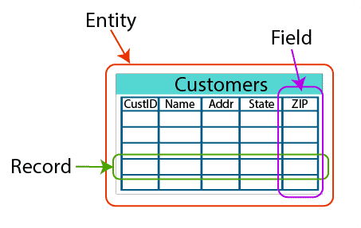
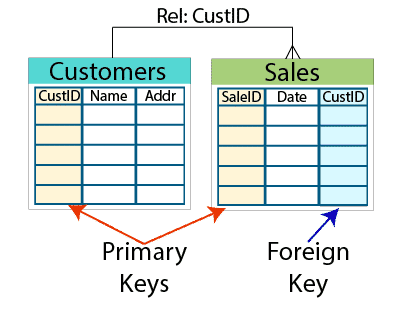

# Relational Databases Introduction

## Tables and relationships
Relational databases rely on a series of structures, called tables, to hold data. These tables group data based on a person, place, thing, or event related to that data. These groupings are referred to as entities. Each entity is stored as a table.

A column, known as a field, describes one attribute of the entity. A row, known as a record, represents a single instance of an entity. Think of a spreadsheet, where each row has a cell for each column. Each cell can contain a value. Rules within the schema define if the attribute is required or optional.

To create a relationship between tables, you first need to ensure that every row in a table is unique. Do this by creating a primary key (for example, a customer ID) in a table to give each record a unique value. A foreign key uses values from the primary key in another table to define a record in the current table. This is what builds a relationship between two tables. Some database engines can enforce this relationship by ensuring that only values from a primary key can be used as a foreign key.

## Data indexing
You navigate a relational database using structured query language, or SQL. Tables should be indexed to allow a query to quickly find the data needed to produce a result. Indexes can also help control the way data is physically stored on disk. They physically group records into a predictable order based on the key values within the table. This plays a huge part in the speed and efficiency of queries.

The preceding graphic shows an example of how having an index can increase query speed. Without an index, the query must scan 12,000 rows to find orders placed on a specified date. When the table is indexed by OrderDate, for example, the query seeks the range of orders placed only on the specified date. In the case here, the query would be faster because it is only searching the 50 rows in the range.

### Online transaction processing (OLTP) 
Online transaction processing (OLTP) databases focus on recording Update, Insertion, and Deletion data transactions. OLTP queries are simple and short, which require less time and space to process. A great example of an OLTP system is a bank ATM, in which you can modify your bank account using short transactions.

### Online analytical processing (OLAP)
Online analytical processing (OLAP) databases store historical data that has been input by OLTP. With OLAP databases, users can view different summaries of multidimensional data. Using OLAP, users can extract information from a large database and analyze it for decision making. A good example of an OLAP system is a business intelligence tool.

