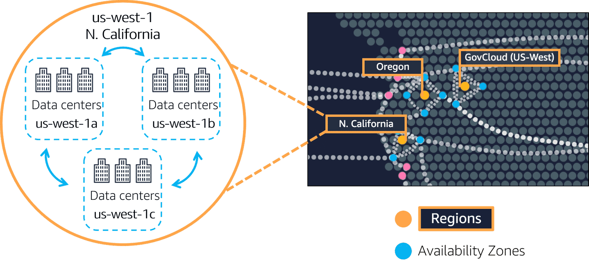
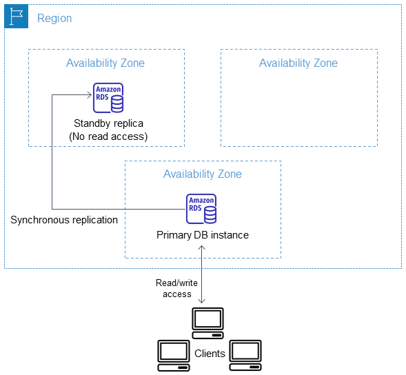
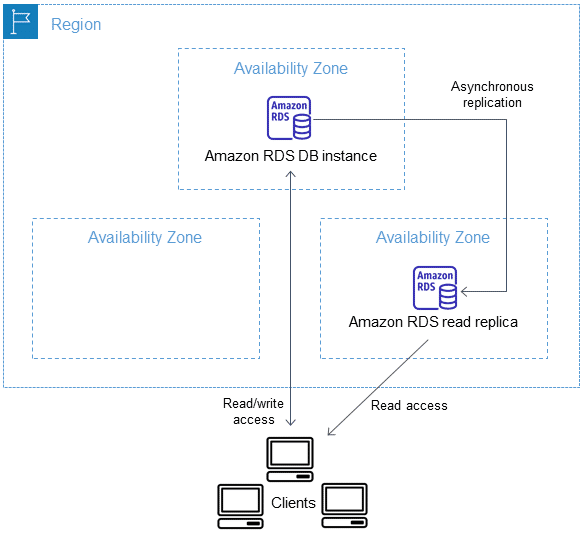
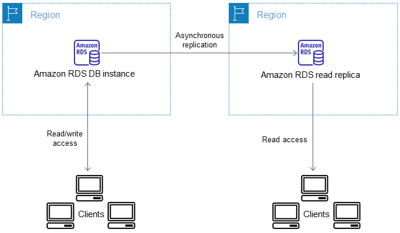
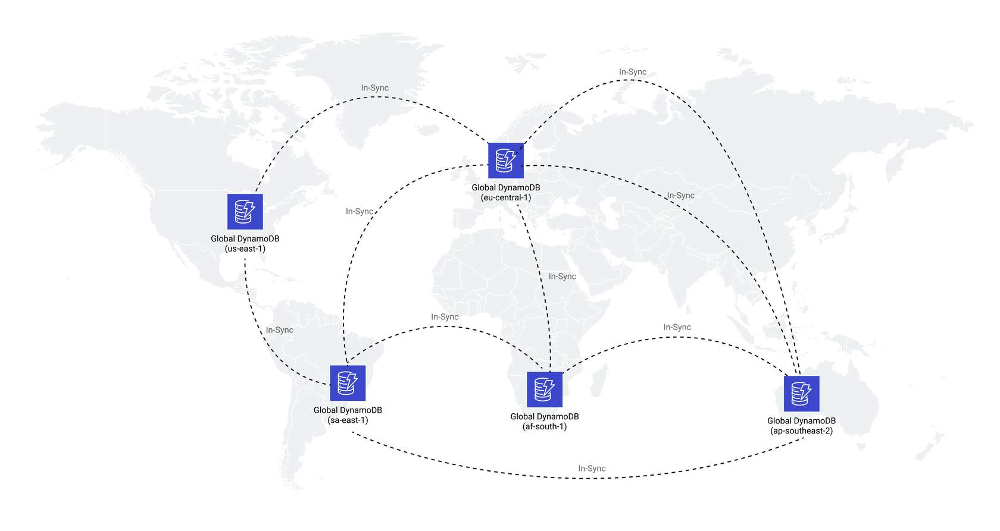
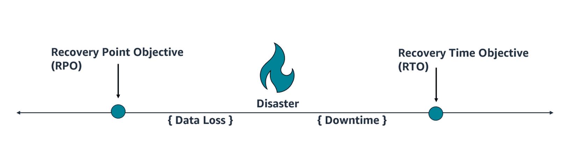
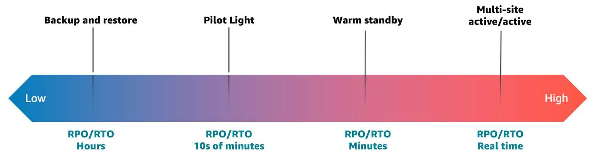

# Designing database solutions for reliability

## Resiliency

### AWS Regions and Availability Zones

When designing an Amazon Relational Database Service (Amazon RDS) database solution, you can use AWS Regions and Availability Zones to promote reliability. The AWS global infrastructure is built around AWS Regions and Availability Zones. Within a Region, there are multiple physically separated and isolated Availability Zones. You can design your database to automatically fail over between Availability Zones without interruption.

### Multi-AZ

With some AWS database services, such as Amazon RDS, you can deploy a Multi-AZ database. When you do, your primary database will be synchronously copied into another Availability Zone within the same Region. AWS will choose the Availability Zones for you. Should your primary database fail, you can automatically switch over to the secondary database to ensure availability of your database.

### Read replicas

Another example of reliability in database architecture is built-in replication functionality to create a database instance called a read replica. Read replicas are a great way to scale horizontally for high availability in read-heavy workloads. Read replicas are copied asynchronously from your primary database. You can route read queries to the read replica to alleviate the workload off a single database.

### Cross-Region replicas

With Amazon RDS, you can create a MariaDB, Aurora MqSQL, MySQL, Oracle, or PostgreSQL read replica in a different Region from the source database instance. Creating a cross-Region read replica isn't supported for SQL Server on Amazon RDS. This ensures high availability because, even if an entire Region experiences a failure, your customers will still have access to your database.

### Global tables

A global table is a collection of one or more replica tables, all owned by a single AWS account

When you create a DynamoDB global table, it consists of multiple replica tables (one per Region) that DynamoDB treats as a single unit. Every replica has the same table name and the same primary key schema. When an application writes data to a replica table in one Region, DynamoDB propagates the write to the other replica tables in the other Regions automatically.

Global tables eliminate the difficult work of replicating data between Regions and resolving update conflicts. This way, you can focus on your application's business logic. In addition, with global tables, your applications stay highly available even in the unlikely event of isolation or degradation of an entire Region.

### Maintenance windows
By default, AWS will schedule maintenance of your databases at predetermined times. Maintenance can be many things, but is normally related to performing operating systems updates, engine updates, and upgrades. During these times, your database will be down. Knowing this, it's important to update the maintenance window of your databases to a time when they can be down, such as a known slow point in business. You can also stack your maintenance windows if you have more than one database instance in your workload, so that both databases aren't down at the same time.

### Disaster recovery
What is a disaster? When planning for disaster recovery, evaluate your plan for these three main categories of disaster:

* Natural disaster, such as earthquakes or floods
* Technical failures, such as power or network connectivity failures
* Human actions, such as inadvertent misconfiguration or unauthorized or outside party access or modification

Remember that high availability is not disaster recovery! Both availability and disaster recovery rely on some of the same best practices, such as monitoring for failures, deploying to multiple locations, and automatic failover. However, availability focuses on components of the workload, whereas disaster recovery focuses on discrete copies of the entire workload. Disaster recovery has different objectives from availability, measuring time to recovery after the larger-scale events that qualify as disasters. You should first ensure that your workload meets your availability objectives, as a highly available architecture will help you meet customers’ needs in the event of availability-impacting events. Your disaster recovery strategy requires different approaches than those for availability, focusing on deploying discrete systems to multiple locations, so that you can fail over the entire workload if necessary.

As part of your business continuity plan, your business helps to define disaster recovery strategies including a plan for the recovery time objective (RTO) and the recovery point objective (RPO). This is known as your business continuity plan (BCP) and should be the start of your planning.

#### Recovery point objective (RPO)
* How much data can you afford to recreate or lose? Things such as customer credit card information or otherwise confidential information is likely something you don't want to lose. A list of color options for a certain product can be much easier to recreate or lose all together, for example.

#### Recovery time objective (RTO)
* How quickly must you recover? What is the cost of downtime? Consider this can change over time. A database essential to processing sales could be down for a short period of time during your off season. If it's a key holiday sale time, though, you may need a much faster RTO.

Disaster recovery strategies available within AWS can be broadly categorized into four approaches, ranging from the low cost and low complexity of making backups to more complex strategies using multiple active Regions. It is critical to regularly test your disaster recovery strategy so that you have confidence in invoking it, should it become necessary. 

#### Backup and restore
* Lower-priority use cases
* Restore data after event
* Cost $

A suitable approach for mitigating against data loss or corruption, this approach can also be used to mitigate against a Regional disaster by replicating data to other AWS Regions, or to mitigate lack of redundancy for workloads deployed to a single Availability Zone. In addition to data, you must redeploy the infrastructure, configuration, and application code in the recovery Region.

#### PILOT LIGHT
For pilot light, continuous data replication to live databases and data stores in the disaster recovery Region is the best approach for low RPO. AWS provides continuous, cross-Region, asynchronous data replication for data using the following services and resources:

* Amazon RDS read replicas
* Aurora global tables
* DynamoDB global tables

#### WARN STANDBY
All the AWS services covered under backup and restore and pilot light are also used in warm standby for data backup, data replication, active/standby traffic routing, and deployment of infrastructure including Amazon Elastic Compute Cloud (Amazon EC2) instances. AWS Auto Scaling is used to scale resources including EC2 instances, Amazon Elastic Container Service (Amazon ECS) tasks, DynamoDB throughput, and Aurora replicas within an AWS Region. Amazon EC2 Auto Scaling scales deployment of EC2 instance across Availability Zones within a Region, providing resiliency within that Region. Use auto scaling to scale out your disaster recovery Region to full production capability, as part of a pilot light or warm standby strategy.

#### MULT-SITE ACTIVE/ACTIVE
All the AWS services covered under backup and restore, pilot light, and warm standby are also used for multi-site active/active for point-in-time data backup, data replication, active/active traffic routing, and deployment and scaling of infrastructure, including EC2 instances.