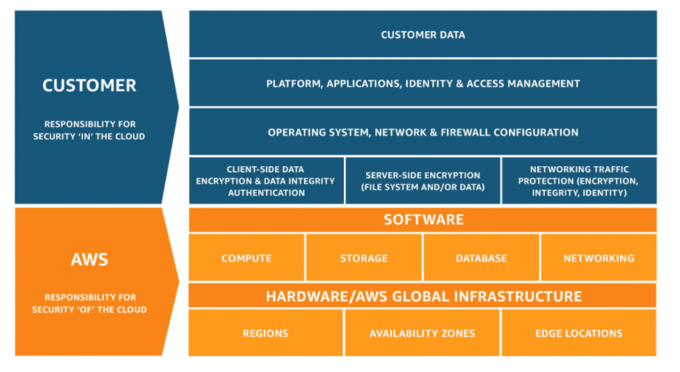

# Designing database solutions for security

## Shared responsibility model
Security is part of the shared responsibility model. As a customer, you are responsible for the security in the cloud, while AWS is responsible for the security of the cloud. The cloud service selected by the customer determines the configuration options required. When securing your database solution or any AWS service, AWS Identity and Access Management (IAM) is an available feature of your AWS account that provides fine-grained access to all of AWS. You can specify who can access which services and under what conditions.

## AWS Identity and Access Management
Use IAM accounts to control access to your database operations, especially operations that create, modify, or delete resources. Such resources include DB instances, security groups, and parameter groups. Also use IAM to control actions that perform common administrative actions, such as backing up and restoring database instances.

When using IAM, it's important to understand a few key concepts and what they are. 

### IAM USERS
An IAM user is an identity that you create in AWS. It represents the person or application that interacts with AWS services and resources. It consists of a name and credentials.

By default, when you create a new IAM user in AWS, it has no permissions associated with it. To allow the IAM user to perform specific actions in AWS:
* Best practice: Create individual IAM users for each person who needs to access AWS.

Even if you have multiple employees who require the same level of access, you should create individual IAM users for each of them. This provides additional security by allowing each IAM user to have a unique set of security credentials.

### IAM POLICIES
An IAM policy is a document that allows or denies permissions to AWS services and resources.

With IAM policies, you can customize users’ levels of access to resources. For example, you can allow users to access all of the databases within your AWS account or only a specific one.

Best practice: Follow the security principle of least privilege when granting permissions.

By following this principle, you help to prevent users or roles from having more permissions than needed to perform their tasks.

For example, if an employee needs access to only a specific database, specify the database in the IAM policy. Do this instead of granting the employee access to all of the databases in your AWS account.

### IAM GROUPS
An IAM group is a collection of IAM users. When you assign an IAM policy to a group, all users in the group are granted permissions specified by the policy.

Assigning IAM policies at the group level also makes it easier to adjust permissions when an employee transfers to a different job.

### IAM ROLES
An IAM role is an identity that a use, application, or service can assume to gain temporary access to permissions.

Before an IAM user, application, or service can assume an IAM role, they must be granted permissions to switch to the role. When someone assumes an IAM role, they abandon all previous permissions that they had under a previous role and assume the permissions of the new role.

Best practice: IAM roles are ideal for situations in which access to services or resources needs to be granted temporarily, instead of long term.

## Data protection - enforcing encryption
### ENCRYPTION AT REST
You should ensure that the only way to store data is by using encryption. AWS KMS integrates seamlessly with AWS database services to make it easier for you to encrypt all your data at rest. For example, AWS KMS integrates with Amazon RDS, Aurora, and DynamoDB, among other databases, to encrypt the data backed by AWS KMS at rest. You can use AWS Config managed rules to check automatically that you are using encryption for RDS instances.

### ENCRYPTION IN TRANSIT
Enforce secure connections between clients and database endpoints using SSL/TLS. Encryption in transit provides an additional layer of data protection by encrypting your data as it travels to and from the database endpoint. Each database engine has its own process for implementing SSL/TLS. Check the Further reading section at the end of this lesson to learn more.