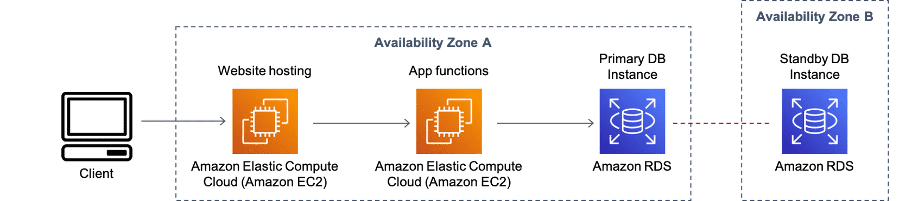

# Server-Based Architecture

AWS offers different ways to deploy your database using a server-based approach in the cloud. This lesson focuses on two AWS database services—Amazon Relational Database Service (Amazon RDS) and Amazon Elastic Compute Cloud (Amazon EC2)—to host your database engine. Before diving into these services, take a look at what a server-based application environment might look like on AWS.

## Use Case: Server-based web application
The following diagram shows a typical use case of a web application using a server-based database solution. This architecture includes website content and application functions hosted on Amazon EC2 instances. Amazon RDS provides data store in multiple Availability Zones for fault tolerance. For more information, choose each of the three numbered markers.

### Amazon EC2
With the Amazon EC2 web service, you can run applications and spin up virtual machines in the AWS Cloud. AWS offers cloud web hosting solutions that provide businesses, nonprofits, and governmental organizations with low-cost ways to deliver their websites and web applications.

### Amazon RDS
Amazon RDS uses Amazon EC2 to create its database instances and configure them with one of the supported database engines. Amazon RDS takes care of all the instance maintenance tasks that you would have to manually perform on premises.

### Amazon RDS Multi-AZ
Amazon RDS Multi-AZ deployments provide enhanced availability and durability for database instances. When you provision a Multi-AZ database instance, Amazon RDS automatically creates a master database instance and synchronously replicates the data to a standby instance in a different Availability Zone.

## Scaling in a server-based architecture
When it comes to server-based architectures, scaling usually comes with a cost and might introduce complexity to a solution. For a web application that’s under too much load, for example, that means finding out what resource your application is running out of on the server.

AWS offers instance monitoring out of the box for its server-based databases. This makes it easier to determine what needs scaling. To handle a higher load in your database, for example, you can vertically scale up your Amazon RDS primary database instance by selecting a bigger instance size. There are currently more than 18 instance sizes to choose from when resizing your Amazon RDS MySQL, PostgreSQL, MariaDB, Oracle, or Microsoft SQL Server instance. Your application can remain online and Amazon RDS manages the scaling.