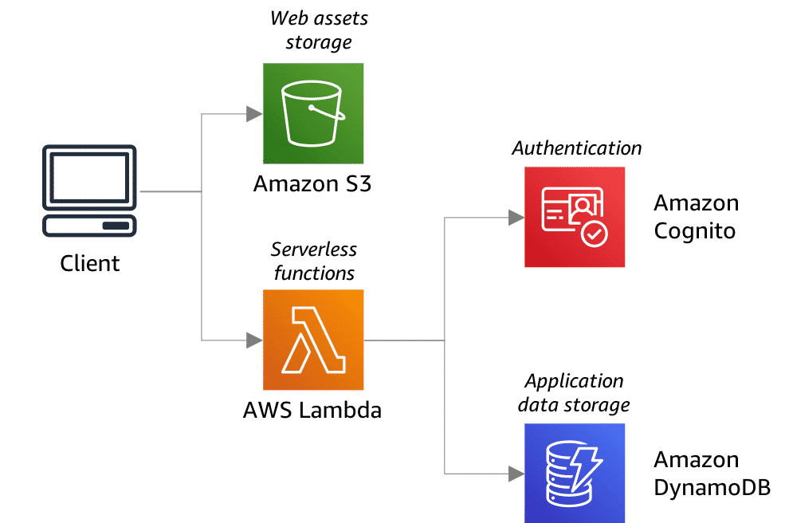

# Serverless Architecture

All AWS serverless database services feature a distributed, fault-tolerant, highly available storage system that automatically scales as demand grows. This lesson focuses on two AWS serverless database solutions: Amazon DynamoDB and Amazon Aurora Serverless. Before diving into these services, take a look at what a serverless application environment might look like on AWS.

## Use Case: Serverless web application
The following diagram shows a typical use case of a web application, similar to the application architecture from the previous lesson, only this time using serverless. This architecture includes website content stored in Amazon Simple Storage Service (Amazon S3), application code executed using AWS Lambda functions, user authentication provided by Amazon Cognito, and DynamoDB to store application data. For more information, choose each of the five numbered markers.

### Client
The user interface of the application is rendered at the client side, which lets you use a simple, static web server.

### Web server
Amazon S3 serves all the static HTML, CSS, and JavaScript files for the application.

### Lambda functions
Lambda functions are the key in a serverless architecture. The application services for logging in and accessing data can be built as Lambda functions. These functions read and write from your database.

### User authentication
Amazon Cognito is an identity service that can be integrated with Lambda. With Amazon Cognito, you can easily add user sign-up and sign-in to your mobile and web apps. The service can also authenticate users through social identity providers or your own identity system.

### Database
DynamoDB automatically scales tables up and down to adjust for capacity and maintain performance. In this diagram, DynamoDB is a nonrelational data store option.

## Scaling in a serverless architecture
When you implement a serverless architecture, your backend AWS services can efficiently and automatically scale, keeping your costs low. Scaling is an event-driven process. For example, when it comes to DynamoDB, you can use Amazon CloudWatch to monitor and track a table’s read and write capacity metrics. Even if you’re not around, DynamoDB automatic scaling monitors your tables and indexes to automatically adjust throughput in response to changes in application traffic as demand increases and decreases.