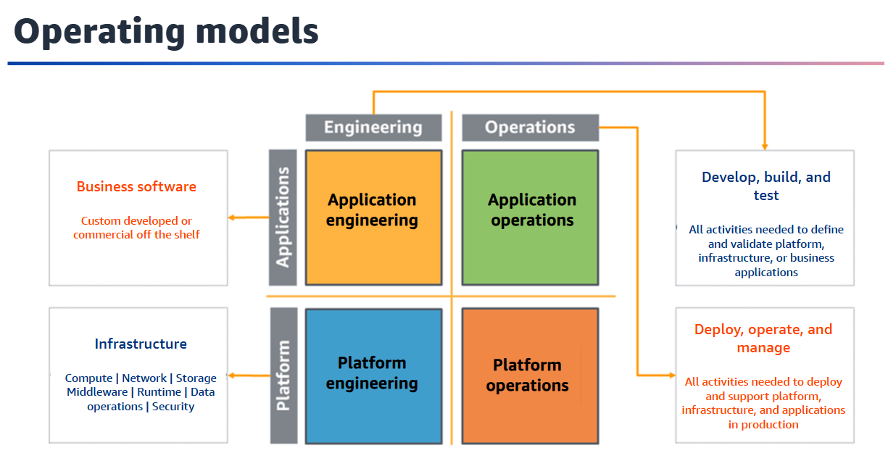

# Operational Excellence Pillar

## What is the operational excellence pillar?
Operational excellence is the ability to support development and run workloads effectively, gain insight into operations, and continuously improve supporting processes and procedures to deliver business value.

## Operational excellence
* Perform operations as code.
* Make frequent, small, reversible changes.
* Refine operations procedures frequently.
* Anticipate failure.
* Learn from all operational failures.

## Operational excellence
* Organization
* Prepare
* Operate
* Evolve

## Organization priorities
* Evaluate external customer needs
* Evaluate internal customer needs
* Evaluate governance requirements
* Evaluate compliance requirements
* Evaluate landscape
* Evaluate trade-offs
* Manage benefits and risks

## Operating models

* Business software
  * Custom developed or commercial off the shelf
* Develop, build, and test
  * All activities needed to define and validate platform, infrastructure, or business applications
* Infrastructure
  * Compute | Network | Storage Middleware | Runtime | Data operations | Security
* Deploy, operate, and manage
  * All activities needed to deploy and support platform, infrastructure, and applications in production.

## Organizational culture
* Executive sponsorship
* Team members are empowered to take action when outcomes are at risk
* Escalation is encouraged
* Communications are timely, clear, and action able
* Experimentation is encouraged
* Team members are empowered, encouraged to maintain and grow skill sets
* Resource teams appropriately
* Divers opinions are encouraged and sought within across teams

## Design Telemetry
* Implement application telemetry
* Implement and configure workload telemetry
* Implement user activity telemetry
* Implement dependency telemetry
* Implement transaction traceability

## Design for operations
* User version control
* Test and validate changes
* Use configuration management systems
* Use build and deployment management systems
* Perform patch management
* Share design standards
* Implement practices to improve code quality
* Use multiple environments
* Make frequent, small, reversible changes
* Fully automate integration and deployment

## Mitigate deployment risks
* Plan for unsuccessful changes
* Test and validate changes
* Use deployment management systems
* Test using limited deployments
* Deploy using parallel environments
* Deployment frequent, small, reversible changes
* Fully auto mate integration and deployment
* Automate testing and rollback

## Operational readiness and change management
* Ensure personnel capability
* Ensure a consistent review of operational readiness
* User runbooks to perform procedures
* Use playbooks to investigate issues
* Make informed decisions to deploy systems and changes
* Facilitate support plans for production workloads

## Understanding workload health
* Identify key performance indicators
* Define workload metrics
* Collect and analyze workload metrics
* Establish workload metrics baselines
* Learn expected patterns of activity for workload
* Alert when workload outcomes are at risk
* Alert when workload anomalies are detected
* Validate the achievement of outcomes and KPI and metric effectiveness

## Understanding operational health
* Identify key performance indicators
* Define operations metrics
* Collect and analyze operations metrics
* Establish operations metrics baselines
* Learn expected patterns of activity for operations
* Alert when operations outcomes are at risk
* Alert when operations anomalies are detected
* Validate the achievement of outcomes and KPI and metric effectiveness

## Responding to events
* Use a process for event, incident, and problem management
* Have a process per alert
* Prioritize operational events based on business impact
* Define escalation paths
* Define a customer communication plan for outages
* Communicate status through dashboards
* Automate responses to events

# Learn, share, and improve
* Have a process for continuous improvement
* Perform post-incident analysis
* Implement feedback loops
* Perform knowledge management
* Define drivers for improvement
* Validate insights
* Perform operations metrics reviews
* Document and share lessons learned
* Allocate time to make improvements