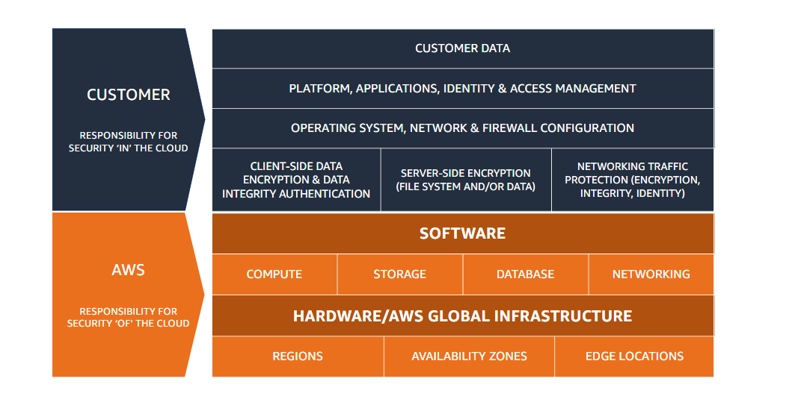

# Security Pillar

## What is the security pillar?
The security pillar encompasses the ability to protect data, systems and assets to take advantage of cloud technologies to improve your security.

## Security
* Implement a string identity foundation
* Turn on traceability
* Apply security at all layers
* Automate security best practices
* Protect data in transit and at rest
* Keep people away from data
* Prepare for security events

## Security
* Security foundations
* Identity and access management
* Detection
* Infrastructure protection
* Data protection
* Incident response
* Application Security

## Shared responsibility

* CUSTOMER: responsibility for security 'in' the cloud
  * customer data
  * platform, applications, identity & access management
  * operating system, network & firewall configuration
  * client-side data encryption & data integrity authentication
  * server-side encryption (file system and/or data)
  * networking traffic protection (encryption, integrity, identity)
* AWS: Responsibility for security 'of' the cloud
  * SOFTWARE
  * COMPUTE
  * STORAGE
  * DATABASE
  * NETWORKING
  * HARDWARE / AWS GLOBAL INFRASTRUCTURE
  * REGIONS
  * AVAILABILITY ZONES
  * EDGE LOCATIONS

## AWS account management and separation
* Separate workloads using accounts
* Secure account root user and properties

## Operating your workloads securely
* Identify and validate control objectives
* Keep up to date with security threats
* Stay current on security recommendations
* Automate testing and validation of security controls in pipelines
* Identify threats and prioritize mitigation using threat model
* Evaluate and implement new security services and features regularly

## Identity management
* Use strong sign-in mechanisms
* Employ temporary credentials
* Store and user secrets securely
* Rely on a centralized identity provider audit and rotate credentials periodically
* Set up user groups and attributes

## Permissions management
* Define access requirements
* Grant least privilege access
* Establish emergency access process
* Reduce permission continuously
* Define permission guardrails for your organization
* Manage access based on lifecycle
* Analyze public and cross-account access
* Share resources securely in your organization
* Share resources securely with a third party

## Detection
* Configure service and application logging
* Analyze logs, findings, and metrics centrally
* Automate response to events
* Implement actionable security events

## Protecting networks
* Create network layers
* Control traffic at all layers
* Automate network protection
* Implement inspection and protection

## Protecting compute
* Perform vulnerability management
* Reduce attack surface
* Implement managed services
* Automate compute protection
* Help people perform actions at a distance
* Validate software integrity

## Classifying data
* Identify data in your workload
* Define data protection controls
* Automate identification and classification
* Define data lifecycle management

## Protecting data at rest
* Implement secure key management
* Enforce encryption at rest
* Automate data-at-rest protection
* Enforce access control
* Use mechanisms to keep people away from data

## Protecting data in transit
* Implement secure key and certificate management
* Enforce encryption in transit
* Automate detection of unintended access
* Authenticate network communications

## Design goals of cloud response
* Establish response objectives
* Document plans
* Respond using the cloud
* Know what you have and what you need.
* Use redeployment mechanisms
* Automate where possible
* Choose scalable solutions
* Learn and improve your process

## Educate
* Development skills
* AWS services
* Application awareness

## Prepare, simulate, iterate
* Identify key personnel and external resources
* Develop incident management plans
* Prepare forensic capabilities
* Pre-provision access
* Automate containment capability
* Pre-deploy tools
* Run game days

## Application security
* Train for application security
* Automate testing throughout development and release lifecycle
* Perform regular penetration testing
* Perform manual code reviews
* Centralize services for packages and dependencies
* Deploy software programmatically
* Regularly assess security properties of pipelines
* Build a program that embeds security ownership in workload teams