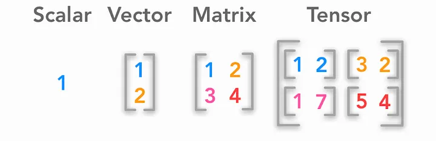
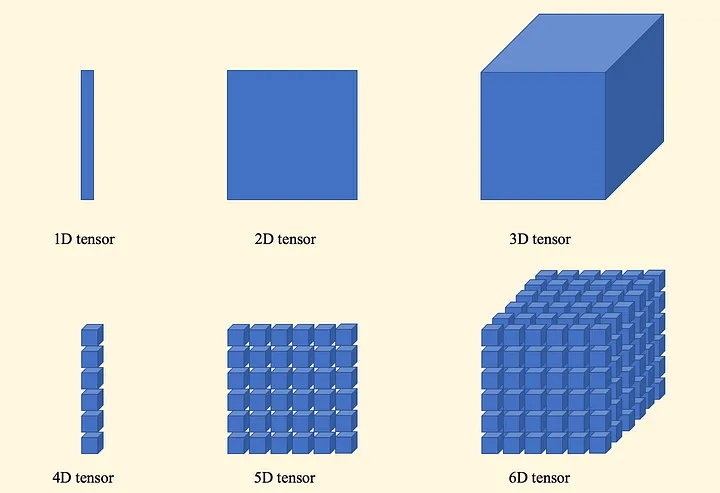

# Data

## Tensor
### Description
數學上可理解為多維數組(Multidimensional Array)。
0階張量為純量、1階張量為向量、2階張量為矩陣、3階張量則是由多個矩陣所組成的。

基本上將數個3D張量放到一陣列中就是所謂的4D張量，通常代表影像的資料，其shape可直觀理解為 (samples, height, width, channels)。
而依次類推就可以得到5D張量、6D張量等

### `torch.tensor` 在程式碼中的用途

#### 將 NumPy 數組轉換為 PyTorch 張量
使用 `torch.tensor(user_vec, dtype=torch.float32)` 將 NumPy 數組轉換為 PyTorch 張量，指定數據類型為 `float32`，以確保與模型的參數（通常也是 `float32`）一致。

為什麼需要轉換？
* PyTorch 的神經網絡只接受張量作為輸入。
* 張量支援 GPU 加速和自動求導，而 NumPy 數組不支持這些功能。

#### 確保數據類型一致
*  參數 `dtype=torch.float32` 確保張量的數據類型為 32 位浮點數，這是深度學習模型中最常用的數據類型。
*  如果不指定 `dtype`，PyTorch 會根據輸入數據的類型推斷，可能導致類型不匹配（例如，`float64` 與模型的 `float32` 不相容）。

#### 準備模型輸入
* `__getitem__` 返回的元組包含資料的張量。
* 這些張量被 `DataLoader` 收集成批次（batch），形狀變為 `(batch_size, vector_dim)`，直接輸入到模型的 `forward` 方法進行計算。

#### 支援後續計算
* 轉換後的張量可以進行數學運算（例如，矩陣乘法、加法）和傳遞到 Transformer 的注意力機制中。
* 雖然程式碼中未設置 `requires_grad=True`（因為這些是輸入數據，不是需要優化的參數），但張量格式確保它們與模型參數（需要梯度）兼容。

## Dataset
Dataset 是一個抽象概念，通常表示一組數據的集合，這些數據可以是圖像、文字、數值向量、標籤等。

* 訪問數據：按索引（index）獲取單個數據樣本。
* 數據預處理：在訪問數據時進行轉換、標準化或增強。
* 與數據載入器配合：與 DataLoader 等工具結合，實現批量數據載入、打亂（shuffle）和並行處理。

在 PyTorch 中，Dataset 是一個抽象基類（torch.utils.data.Dataset），需要自定義一個子類來處理具體數據，Dataset 需要實現以下兩個主要方法：

* __len__(self)：返回數據集的大小（樣本數量）。
* __getitem__(self, idx)：根據給定的索引 idx 返回對應的數據樣本。

## DataLoader
DataLoader是 PyTorch 中用於高效載入數據的工具，負責從 `Dataset` 中提取樣本並組合成批次，提供批量處理、數據打亂和並行載入等功能，`DataLoader` 的作用包括：
* 從 `Dataset` 中載入批次數據，每批包含 32 組消費者向量、正向文章向量和負向文章向量。
* 透過 `shuffle=True` 隨機化數據順序，增強模型泛化能力。
* 提供形狀為 `(batch_size, vector_dim)` 的張量，直接輸入到模型。

