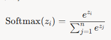

# Softmax
Softmax 在機器學習中是一種常用的激活函數，特別是在多分類問題中，用於將模型的原始輸出（logits）轉換為概率分佈

## 概率轉換
Softmax 將一組實數輸入（通常是神經網絡最後一層的輸出）轉換為一組介於 0 和 1 之間的概率值，且這些概率值的總和為 1。這使得輸出可以被解釋為每個類別的預測概率。

## 數學定義
對於給定的輸入向量  z = [z1, z2, ..., zn]，Softmax 函數計算第i個類別的概率為:

其中 e^zi 是指數函數，放大輸入的差異，確保較大的 zi 對應較高的概率。

## 在多分類中的應用
* 分類決策：Softmax 常用於多分類問題（如圖像分類、文本分類），輸出每個類別的概率，方便選擇概率最高的類別作為預測結果。
* 損失函數配合：Softmax 通常與交叉熵損失（Cross-Entropy Loss）一起使用，因為交叉熵損失能夠有效衡量預測概率分佈與真實標籤分佈之間的差異，驅動模型優化。

## 特性與優勢
* 正規化輸出：Softmax 確保輸出是一個有效的概率分佈，適合需要概率解釋的場景。
* 放大差異：指數運算使得較大的輸入值對應的概率更大，增強模型對最可能類別的信心。
* 可微分：Softmax 是連續可微的，便於通過梯度下降進行優化。

## 局限性
* 數值穩定性：當輸入值Zi過大或過小時，指數運算可能導致溢出或下溢。實務中常通過減去最大值(zi - max(z))來提高數值穩定性。
* 適用場景有限：Softmax 假設類別之間是互斥的，因此不適合多標籤分類（multi-label classification），此時通常使用 Sigmoid 函數。

## 實際應用場景
* 在卷積神經網絡（CNN）中，Softmax 用於圖像分類任務（如將圖像分類為「貓」「狗」「鳥」）。
* 在自然語言處理（NLP）中，Softmax 用於語言模型預測下一個詞的概率分佈。
* 在 Transformer 模型中，Softmax 用於注意力機制（Scaled Dot-Product Attention）來計算注意力權重。