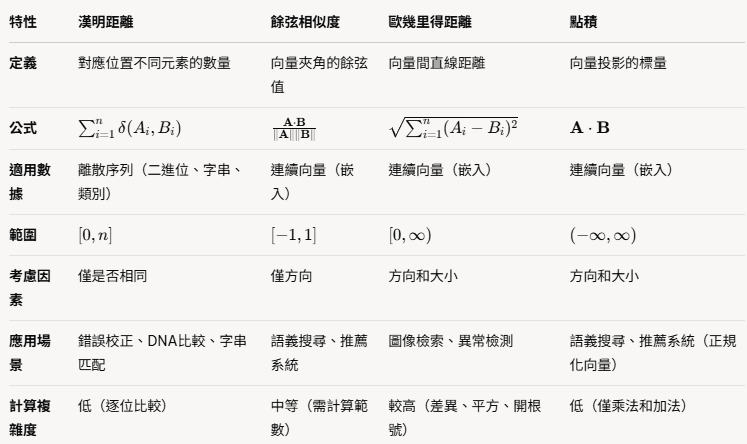

# Math

* [Cosine Distance](cosine_distance.md)
* [Euclidean Distance](./euclidean_distance.md)
* [Dot Product Distance](./dot_product_distance.md)
* [Hamming Distance](./hamming_distance.md)

## Compare

