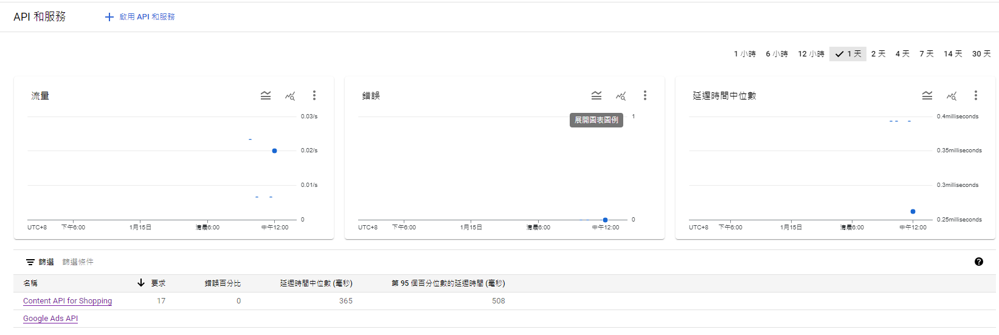

# API和服務
Google提供的API服務，開發額者可以透過建立GCP專案，並在申請Service Account或OAuth Token後，可以透過API來操控像是Map、Cloud、Drive、Calendar、AD等Google服務。

## 已啟用的API和服務

新增要使用Google服務提供的的API，像是畫面中的Content API for Shopping以及Google Ads API就是透過上方的"啟用API與服務"，進入程式庫後新增API後，該專案才有權限呼叫API。

頁面有統計畫面顯示API被呼叫的次數與回應時間

## 程式庫
可以搜尋並新增要使用的服務所提供的API，搜尋完點選啟用

## 憑證
有三種，分別是API金鑰、OAuth 2.0用戶端ID，服務帳戶

* API Key
透過在API後面加上key=${API_KEY}，來取得API呼叫權限

* OAuth 2.0
透過Google提供的OAuth資訊產生Refresh Token，並寫在專案api config property檔案中，讓專案有使用Lib API的權限

* Service Account
產生Service Account的同時會產生Credential.json，將Service Account配至到服務帳號後，將Credential.json放在專案中，就可以讓專案有使用Lib API的權限

## OAuth同意畫面
設定OAuth的授權網域，可使用的服務範圍像是Content、AD等等、發佈狀態、OAuth使用者人數上限、OAuth頻率限制

## 頁面使用協議
目前暫時不知道用處
