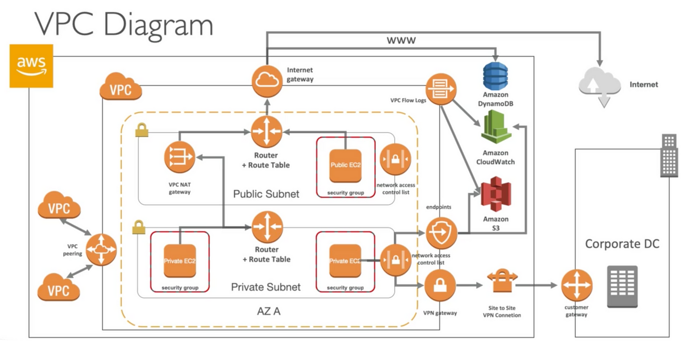

# Network

## VPC
管理一個Region中各Zone的Instance虛擬網路設定，每個VPC有自己的CIDR Block，像是10.0.0.0/16

## Availability Zones
機房，每個機房存在不同的Region

## Region
網域，有分北美洲、南美洲、歐洲、中東、非洲、亞太區域、澳洲、紐西蘭，每個Region有一到多個Zone

## Instance
AWS在各Zone建立的虛擬機器服務的實體，每個Instance有自己的IP

## Subnet
一個Zone根據網段切出來的子網路，每個Subnet可以存放多個Instance。
每個Subnet在VPC底下有自己的CIDR Block，像是10.0.1.0/24
有分Public / Private，主要差異是Public Subnet可以透過Route Table與Internet Gateway來跟外部網路溝通，但是Private不能。

Public Subnet是合用在API Application、Web Application那種可以公開給User操作的應用，Private則像Database那種不應給外部用戶知道的服務，而如果Public要跟Private溝通的話要透過VPC NAT gateway。

## Route Table
管理Target可以連到Subnet的Router Table配置，每個Subnet最多一個Route Table。

| Destination | Target |
|-------------|--------|
| 10.0.0.0/16 | Local  |
| 0.0.0.0/0   | igw-id |

常見Target有以下幾種
* Local
* NAT Gateway，public subnet與private subnet溝通的接口
* Internet Gateway(簡稱igw)，vpc對外部網路接口
* Virtual Gateway(簡稱vgw)，vpc對企業內部VPN接口

## Network Access Control List (NACL)
配置特定Source IP可以連到內部網路的特定Port，可以視為防火牆

## Network Address Translation(NAT) Gateway
Private Subnet對外的網路連線配置

## Internet Gateway
讓外部Internet可以透過公有IP跟Region溝通

## End Point
讓Instance可以透過內部網路跟其他AWS服務(S3、Cloud Watch)溝通

## Peering Connection
讓VPC與VPC可以透過內部網路互相溝通

## VPC Flow Logs
網路流量Log，可以選擇發到Cloud Watch或是S3