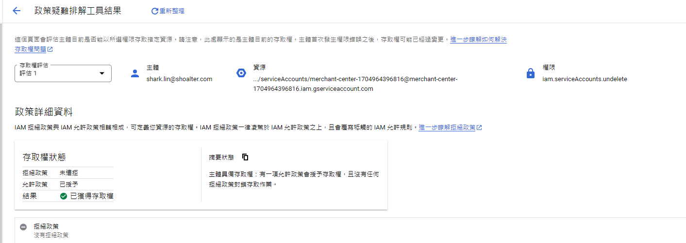
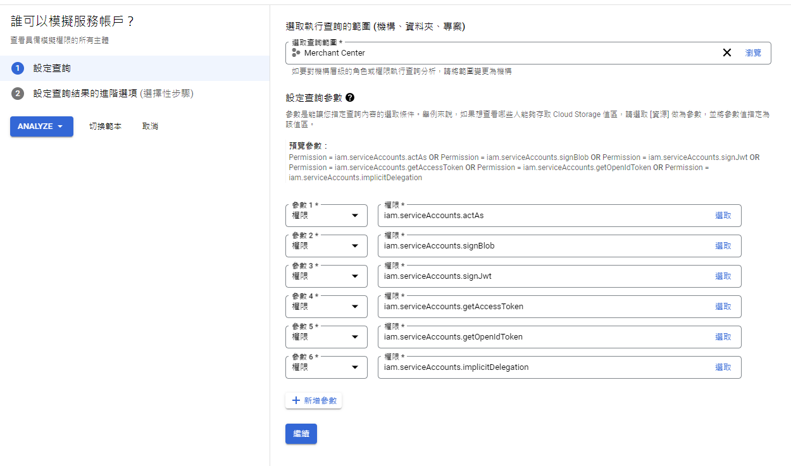
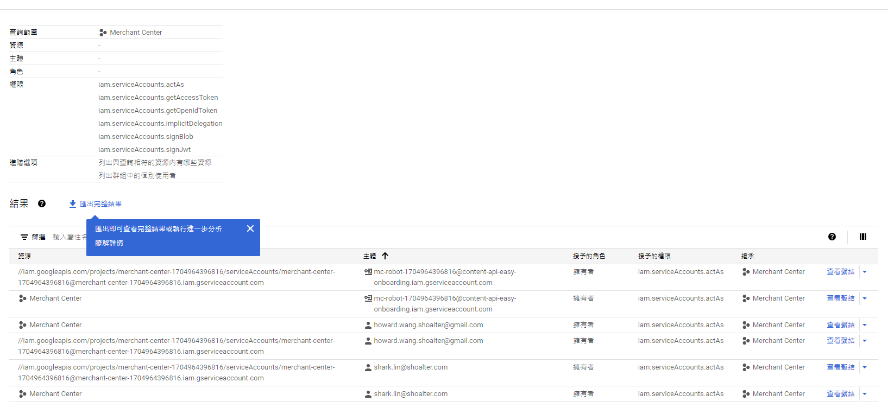
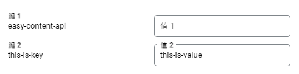

# IAM
管理GCP專案內用戶在專案的身分與權限

## 身分與存取權管理
新增用戶道專案，設定用戶的身分、角色

## 身分識別與機構
因為需要機構，且設定機構需要網域，所以暫時無法研究

## 政策宜難排解工具
輸入主體、資源、與權限，按下搜尋，可以看到相關存取權狀態

## Policy Analyzer
輸入查詢範圍(專案)跟參數(資源、主體、角色、權限)，查詢誰擁有哪些資源的存取權

## 機構政策
看了一下，應該不會用到

## 服務帳戶
透過建立一個服務帳戶，拿到該帳戶的Credential.json，其他外部開發專案就可以透過Lib存取專案服務

## Workload Identity聯盟
待補充

## 員工身分聯盟
因為需要機構，且設定機構需要網域，所以暫時無法研究

## 標籤
將專案加上標籤(Key - Value)，作用不明

## 標記
將專案加上標記(Label、Description)，可以搭配防火牆

## 設定
編輯專案名稱

## 隱私權與安全性
同意Cloud隱私權條款與法律、新增專案聯絡人資訊、設定監管機關

## Identity-Aware Proxy
待補充

## 角色
設定專案內的角色，以及角色的權限

## 稽核紀錄
決定哪些服務的操作方式(管理員讀取、資料讀取、資料寫入)要被記錄下來